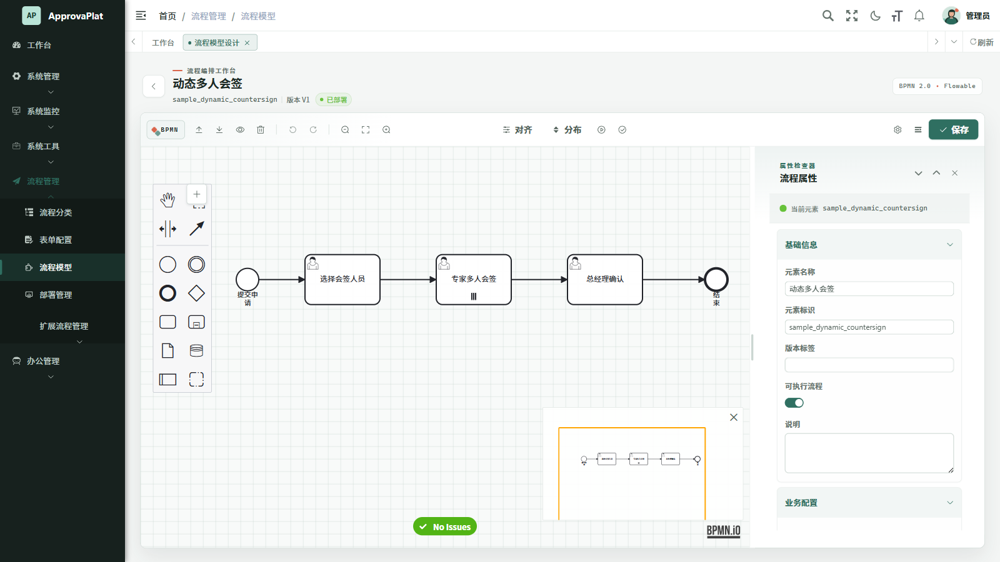
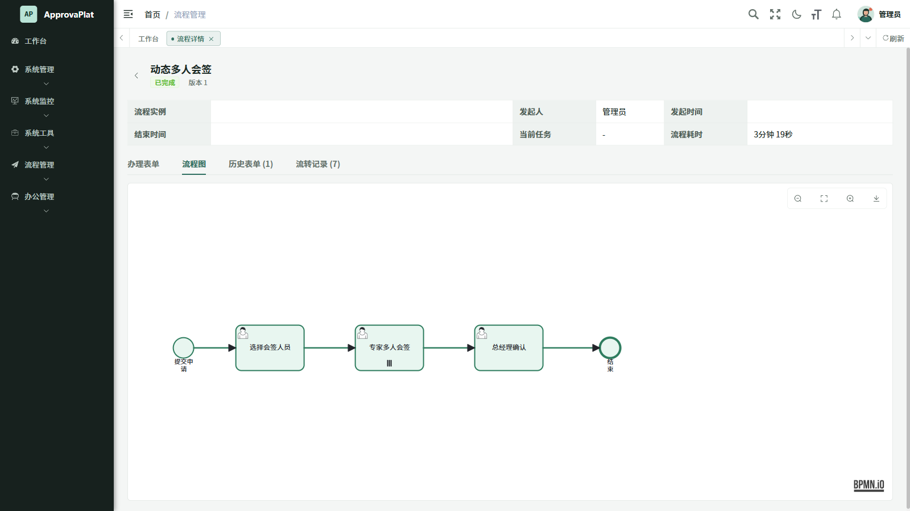

<div align="center">

# ApprovaPlat

**Run approval workflows for real, not just draw process diagrams.**

An open-source approval platform built on RuoYi, Flowable 8, Spring Boot 4, and Vue 3, still under active development.

[中文](README.md) | **English**

[Quick start](#quick-start) · [Current capabilities](#what-works-today) · [Current limits](#current-limits) · [Documentation (Chinese)](docs/README.md)

[](https://github.com/flowable/flowable-engine) [](https://spring.io/projects/spring-boot) [](https://vuejs.org/) [](#where-the-project-stands) [](LICENSE)

</div>

<p align="center">
  
  <br />
  <sub>Dynamic multi-instance approval process designer</sub>
</p>

<table>
  <tr>
    <td width="33%" align="center"><strong>Design and release</strong><br />BPMN, forms, versions, and deployments</td>
    <td width="33%" align="center"><strong>Requests and approvals</strong><br />Multi-instance tasks, returns, withdrawals, and audits</td>
    <td width="33%" align="center"><strong>Engineering and migration</strong><br />Authorization, data, testing, and operations</td>
  </tr>
</table>

## Why ApprovaPlat exists

I encountered enterprise approvals during an internship on a B2B AI product and became interested in how an approval platform connects processes, forms, authorization, and business data.

I wanted a modern open-source project built on Flowable 8 as a reference. The closest reasonably complete option I found was [Yudao](https://github.com/YunaiV/ruoyi-vue-pro), but it was not a Flowable 8 project. Its README says, “There is no commercial edition now and there never will be; all code is open source,” while its official [workflow documentation](https://doc.iocoder.cn/bpm/) marks the BPM SQL as available only to Yudao Planet members, including for commercial use.

To keep reading the related documentation, I used the [`Fuck-Yudao`](https://github.com/AntHubTC/AntHubTC.github.io/blob/master/tampermonkey-script/Fuck-Yudao.js) Tampermonkey script and also came across a third-party repository describing itself as [“Yudao source code, no fig leaf edition”](https://github.com/talkpoin/ruoyi-spring-boot-all). That is where I disagree: if “all code is open source” is the promise, the open scope and paid boundary should be clear from the start.

Unable to find the project I wanted, I started ApprovaPlat. It is not simply a Flowable version replacement; the goal is to connect design, deployment, submission, task handling, authorization, data, and auditing on Flowable 8.

The project is still early, and its core code, SQL, documentation, and tests will remain public. Feedback from experienced developers is always welcome, and I hope anyone building, planning, or migrating an approval system can find implementations and lessons here that are genuinely useful.

## Where the project stands

ApprovaPlat still has a long way to go before it becomes a mature approval platform. The capabilities below exist in the repository today; they are not a roadmap written in the present tense.

Today, process design, deployment, submission, task handling, history, and audit queries form a working path. Flowable 8 executes the workflows, MySQL stores business data, and Redis handles login state and caching. It is ready to serve as a learning, evaluation, or secondary-development base, but it should not be placed into production without validation in the target environment.

It is currently best suited to:

- Learning Flowable 8 and how an approval system connects its frontend, backend, authorization, and data.
- Serving as a reference implementation or foundation for a new approval project.
- Comparing capabilities and validating a migration from an older Flowable release or another workflow engine.
- Running a pilot before production while completing deployment, capacity, and failure testing for the target environment.

## What works today

### Design and release

- Manage process categories, dynamic forms, BPMN models, versions, and deployment state.
- Import, export, preview source, run linting and token simulation, and edit node properties in the BPMN.js designer.
- Validate BPMN on the backend before deployment. Freeze form, extension, DMN, and SLA snapshots on deployment, then suspend the old definition while in-flight instances continue.

### Requests and approvals

- Use dedicated views for new requests, my requests, inbox, claimable tasks, completed work, and CC notifications.
- Start, withdraw, cancel, terminate, suspend, and activate process instances; claim, approve, delegate, transfer, return, and reject tasks.
- Run ALL and ANY multi-instance approval modes, add or remove approvers dynamically, and handle concurrent update conflicts.
- Persist submission and deployment form snapshots. Attachment handling covers object-level authorization, quotas, binding, downloads, deletion, and physical cleanup.

### Advanced workflows and integration

- Run controlled repeat approval with an exit condition, maximum iterations, and an audit trail for each round.
- Use BPMN Error, Escalation, boundary timers, business calendars, approval SLAs, and DMN decisions.
- Use controlled Java/CEL, HTTP and SQL connectors, integration credentials, and runtime event endpoints.
- Participant, MessageFlow, and multi-pool collaboration are backed by persistent delivery, idempotency, ordering, retries, dead letters, and auditing.

### Authorization, data, and operations

- Separate design, submission, approval, administration, and audit duties, with object-level authorization for instances, tasks, deployments, attachments, and audit data.
- Keep Flowable and business data in the same primary datasource and transaction boundary. The frontend does not keep a second authoritative workflow state.
- Provide health checks, runtime snapshots, Micrometer/Prometheus metrics, attachment cleanup locks, and runtime readiness validation.
- Include production configuration, systemd, Nginx, and approval sample provisioning assets.

## Screenshots

The view below shows a dynamic multi-instance approval completed in a real frontend, backend, Flowable, MySQL, and Redis environment. The page reloads the instance state and deployed BPMN, then highlights the path that actually ran.



## Current limits

The following cannot yet be described as fully supported:

- The first production database baseline supports a clean, empty schema. It does not promise automatic upgrades from unpublished development databases.
- `flowable.database-schema-update=false` is a fixed boundary. Production schema changes must use maintained SQL and runtime validation.
- `ComplexGateway` cannot currently be deployed. Native standard loops may round-trip as XML; business repetition uses the project's controlled-loop capability.
- Async executors are disabled by default. Enabling timers, SLAs, or background work requires database, topology, capacity, monitoring, and single-executor coordination validation.
- Multi-node deployment, shared attachment storage, real external side effects, backup recovery, and long-duration stability still require validation in the actual target environment.

See the [approval behavior contract](docs/contracts/workflow-behavior.md) and [multi-pool collaboration contract](docs/contracts/workflow-collaboration.md) for precise boundaries.

## Quick start

### Requirements

- JDK 17+
- Maven 3.9+
- Node.js 20+
- npm 10+
- MySQL 8
- Redis 6+

### 1. Initialize the database

Create an empty MySQL schema and run the RuoYi, Quartz, Flowable, and ApprovaPlat SQL in the exact order documented in the [database baseline](docs/database/workflow-baseline.md). All MySQL client connections should explicitly use `utf8mb4`.

The initial baseline contains a destructive clean-install script. Do not run it against an existing business database, and do not enable Flowable automatic schema updates to bypass missing structures.

### 2. Configure and start the backend

Set local environment variables in PowerShell using values from your MySQL environment:

```powershell
$env:RUOYI_DB_URL = 'jdbc:mysql://127.0.0.1:3306/approvaplat?useUnicode=true&characterEncoding=utf8&useSSL=false&allowPublicKeyRetrieval=true&serverTimezone=Asia%2FShanghai'
$env:RUOYI_DB_USERNAME = '<application-user>'
$env:RUOYI_DB_PASSWORD = '<application-password>'
$env:DRUID_MONITOR_USERNAME = 'local'
$env:DRUID_MONITOR_PASSWORD = '<separate-monitor-password>'
$env:RUOYI_PROFILE = Join-Path $env:LOCALAPPDATA 'ApprovaPlat\uploads'

mvn -pl ruoyi-admin -am -DskipTests package
java -jar .\ruoyi-admin\target\ruoyi-admin.jar --server.address=127.0.0.1
```

`-DskipTests` only shortens the first local startup. If `RUOYI_TOKEN_SECRET` is not set, a single-node installation generates and reuses a random HS512 secret in the user's private directory; production deployments must manage secrets and database configuration explicitly.

### 3. Start the frontend

Open another PowerShell window:

```powershell
Set-Location ruoyi-ui
npm ci
$env:VITE_OPEN_BROWSER = 'false'
npm run dev -- --host 127.0.0.1 --port 1024
```

Open `http://127.0.0.1:1024`. The clean local baseline account is `admin` with initial password `wang`. It is for local development only; change it before exposing the service beyond your machine.

To explore the included approval samples, follow the [sample provisioning guide](deployment/samples/workflow/README.md). It creates them through platform APIs rather than writing directly to Flowable or business tables.

## Development and testing

Common development checks:

```powershell
mvn clean verify

Set-Location ruoyi-ui
npm run test:contracts
npm run build:prod
```

Verification against real MySQL and Redis instances, real roles, and APIs requires the corresponding runtime environment and isolated data.

## Technology

| Area                  | Technology                                             |
| --------------------- | ------------------------------------------------------ |
| Backend               | Java 17, Spring Boot 4.0.6                             |
| Workflow and decision | Flowable 8.0.0 Process / DMN                           |
| Data                  | MyBatis, MySQL 8, Redis                                |
| Frontend              | Vue 3.5.26, Vite 6.4.3, Element Plus 2.13.1            |
| Designer              | BPMN.js 18.22.0                                        |
| Rules and connectors  | CEL, JSqlParser, controlled Java / HTTP / SQL          |
| Observability         | Spring Boot Actuator, Micrometer, Prometheus           |
| Verification          | JUnit 5, frontend contract tests, production builds    |

## Repository layout

```text
ApprovaPlat/
|- pom.xml       Maven reactor entry point
|- ruoyi-*/      Spring Boot backend modules and Flowable domain module
|- ruoyi-ui/     Vue 3 frontend, workflow designer, and contract tests
|- sql/          Database baseline, business schema, and menu permissions
|- docs/         Architecture, behavior, database, and project decision docs
`- deployment/   Production config, systemd, Nginx, and approval samples
```

## Documentation

| Topic                                          | Start here                                                                                            |
| ---------------------------------------------- | ----------------------------------------------------------------------------------------------------- |
| System boundaries and data flow                | [Platform architecture](docs/architecture/workflow-platform.md)                                       |
| Constraints for every approval action          | [Approval behavior contract](docs/contracts/workflow-behavior.md)                                     |
| Participant and MessageFlow                    | [Multi-pool collaboration contract](docs/contracts/workflow-collaboration.md)                         |
| Clean installation and managed migrations      | [Workflow database baseline](docs/database/workflow-baseline.md)                                      |

## Contributing

Issues and pull requests are welcome, especially when they bring a real approval scenario, migration problem, or hard-earned lesson into the project.

For a new BPMN element or approval action, explain how it is edited, how it runs, who may use it, where its data is stored, what remains after failure, and how it will be tested.

## Upstream projects and license

ApprovaPlat builds on open-source projects including [RuoYi-Vue](https://github.com/yangzongzhuan/RuoYi-Vue), [Flowable](https://github.com/flowable/flowable-engine), and [bpmn.io](https://github.com/bpmn-io/bpmn-js).

This is an independent open-source project, not an official component of those projects. The code is available under the [MIT License](LICENSE).

> May we all find our direction in the age of AI, build what we set out to build, and enjoy success and a smooth road ahead.
