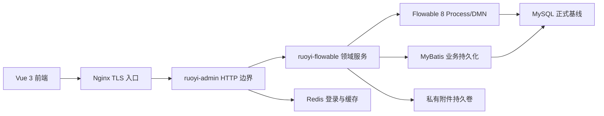

# 审批平台架构

## 产品定位

ApprovaPlat 是基于 RuoYi 前后端分离框架和 Flowable 8 的企业审批平台。项目目标是形成可以真实部署、真实持久化、可审计和可运维的业务系统，不以演示页面、Mock 接口或本地状态作为完成标准。

平台覆盖流程分类、表单、BPMN 模型、部署、DMN、扩展注册表、HTTP/SQL 连接器、运行事件、发起与审批工作台、附件、审计和实例运维。

## 运行结构

## 模块职责

- `ruoyi-admin`：HTTP 协议、参数校验、登录用户权限、下载响应和操作日志入口。
- `ruoyi-flowable`：对象授权、状态校验、事务、Flowable 命令、业务表写入、附件和集成能力。
- `ruoyi-system`：用户、角色、部门、菜单和系统操作日志主数据。
- `ruoyi-ui`：真实 API 调用、管理页面、工作台、BPMN 设计/查看和表单运行时。
- `sql/flowable`：Flowable 官方表、工作流业务表和菜单权限。

## 接口边界

- 登录用户范围由 16 个工作流 Controller 提供 103 个正式入口，并由五角色 RBAC 矩阵冻结方法、路径和权限表达式。
- 运行事件由独立 Controller 提供 3 个机器调用入口，不使用登录用户 Token，必须通过集成 Token、限流、幂等和审计校验。
- URL 权限不能替代对象授权。流程实例、任务、附件、部署和审计查询都必须再次验证当前用户与目标对象的业务关系。

## 数据与事务

- Flowable `ACT_*` 与项目 `wf_*` 共用主数据源和 Spring 事务管理器。
- 一次审批动作涉及的引擎状态、业务记录、附件绑定和审计结果必须原子提交或整体回滚。
- 已部署流程读取不可变表单、扩展和 DMN 快照；编辑态模板变化不能修改已发布版本的运行语义。
- 生产配置固定 `flowable.database-schema-update=false`，应用不得自动创建或升级数据库结构。

## 安全边界

- 用户身份只来自正式 `sys_user`、`sys_role`、`sys_dept` 数据。
- BPMN 扩展只允许服务端已安装并登记的实现，禁止任意类名、脚本或不受控网络访问。
- 附件只保存受控相对路径，文件位于 Web 根目录之外；上传、读取和删除同时执行权限、对象、容量和生命周期校验。
- 凭据只通过受控环境变量、私有密钥文件或加密密钥系统注入，不能进入源码、SQL、发布包清单或测试报告。

## 运行原则

- executor 默认关闭，只有数据库、拓扑、容量、监控和唯一执行协调全部通过后才能启用。
- 单节点可以使用本地持久卷；多节点必须共享附件存储并采用经过验证的 executor/清理锁拓扑。
- readiness、数据库、Redis、工作流运行快照、附件存储和关键低基数指标共同决定是否可以接收流量。
