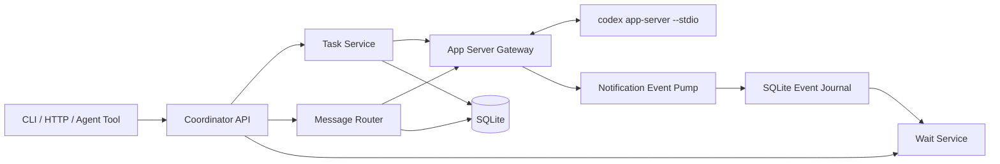

# 基于 Codex App Server 的跨任务协调器落地方案

## 1. 文档目标

本文只解决一个明确问题：实现类似 Codex App 的“独立任务之间发送消息、等待完成、读取历史和继续执行”的本地开源协调器。

目标行为已经通过真实 Codex 任务验证：

1. 创建独立任务，立即得到稳定 `threadId`。
2. 任务异步执行，不阻塞创建调用方。
3. 另一个任务可通过目标 ID 追加消息。
4. 目标空闲时启动新 turn；目标运行时可排队或 steer 当前 turn。
5. 调用方可等待一个或多个目标的完成、失败或需要输入事件。
6. 调用方可分页读取目标 thread、turn 和 item 历史。
7. 跨任务消息保留可信的来源任务 ID。

本文不是通用分布式 Agent 平台方案，也不试图复制 OpenAI 未公开的 Codex App 云端实现。

## 2. 对上一版方案的反思

上一版方案不够落地，主要问题如下。

### 2.1 重复实现 Codex 已公开的能力

上一版计划自行设计 Thread、Turn、模型工具循环、Worker lease 和完整任务状态库，但 OpenAI 官方 `codex app-server` 已经公开：

- Thread、Turn、Item 三个核心原语。
- `thread/start`、`thread/resume`、`thread/fork`、`thread/list`、`thread/read`。
- `turn/start`、`turn/steer`、`turn/interrupt`。
- `turn/started`、`item/*`、`turn/completed` 等通知。
- stdio JSONL 双向协议和版本匹配的 TypeScript/JSON Schema 生成器。

重复实现这些能力会引入状态漂移、上下文兼容和工具行为不一致，且无法真正复现 Codex 任务语义。

### 2.2 过早引入无关基础设施

上一版直接加入 PostgreSQL、Redis Streams、Temporal、Kubernetes、gVisor、分布式 lease 和多租户 RBAC。这些只在多主机 SaaS 阶段才可能需要，不能作为本地可运行版本的前置条件。

本版 MVP 固定为：

```text
单机进程 + codex app-server 子进程 + SQLite + 本地 HTTP/CLI
```

### 2.3 把 MCP 和任务编排混在一起

MCP 是工具接入协议，不是任务消息队列。跨任务通信由协调器调用 Codex App Server 的 Thread/Turn API 实现。MCP 由 Codex App Server 按其配置加载，本项目第一版不再实现独立 MCP Client。

### 2.4 给出未经环境验证的容量和工期承诺

上一版的线程数量、延迟目标、团队人数和周数没有目标机器、模型延迟和使用规模依据。本版只给实现顺序、验收场景和扩展触发条件，不把估算冒充技术事实。

### 2.5 自定义 REST 模型偏离官方协议

对外可以提供 REST 或函数工具，但内部必须映射到官方 App Server JSON-RPC，而不是建立第二套互不兼容的 Thread/Turn 定义。

## 3. 官方技术基线

本地官方资料：

- [Codex App Server](./openai-official/codex-app-server.md)
- [OpenAI Agents SDK](./openai-official/openai-agents-sdk.md)
- [OpenAI API OpenAPI](./openai-official/openai-openapi.yaml)
- [来源与校验清单](./openai-official/SOURCE-MANIFEST.md)

### 3.1 Codex App Server

本方案核心依赖 `codex app-server`，原因是它就是 Codex 富客户端使用的公开接口。

官方文档确认：

- 协议类似 MCP，但使用自己的双向 JSON-RPC 2.0 消息。
- 默认 transport 是 stdio，每行一个 JSON 消息。
- WebSocket transport 目前属于 experimental/unsupported，不作为本方案生产依赖。
- 每条连接必须先发送 `initialize`，再发送 `initialized` 通知。
- `thread/start` 创建会话，`turn/start` 提交用户输入并开始执行。
- `turn/completed` 是 turn 结束的确定性通知。
- 队列饱和时服务端返回 JSON-RPC `-32001`，客户端应指数退避并加入 jitter。
- 当前二进制可以生成与其版本严格匹配的 TypeScript 或 JSON Schema。

### 3.2 Agents SDK 的位置

Agents SDK 适合从模型层自行构建 Agent、handoff、guardrail、session 和 tracing。

本项目第一版不使用 Agents SDK 实现任务运行时，因为 Codex App Server 已经负责 Codex Agent loop、工具、上下文、审批和历史。如果未来要脱离 Codex 运行时，才启动单独的 Agents SDK 后端适配项目。

### 3.3 Responses API 的位置

官方 OpenAPI 已确认存在 `POST /responses`。本项目第一版不直接调用 Responses API；模型调用由 Codex App Server 管理。保留 OpenAPI 本地快照用于：

- 理解 Codex 上游模型能力。
- 未来实现非 Codex Runtime Adapter。
- 校验 `previous_response_id`、background response 等可选替代方案。

## 4. 范围与非范围

### 4.1 第一版必须实现

- 启动并监管一个 `codex app-server` stdio 子进程。
- 完成 initialize/initialized 握手。
- 创建、恢复、分叉、列出和读取 Codex thread。
- 对空闲目标发送新 turn。
- 对运行中目标提供 `queue` 和显式 `steer` 两种模式。
- 保存跨任务来源、幂等键和投递状态。
- 等待最多 8 个任务的状态变化。
- 进程重启后恢复未投递队列。
- 取消运行中的 turn。
- 生成稳定的 CLI 和本地 HTTP API。
- 使用真实 Codex App Server 做端到端验收。

### 4.2 第一版明确不实现

- 自建模型 Agent loop。
- 自建 Thread/Turn 全量历史库。
- 浏览器 UI。
- 多主机调度。
- Redis、Kafka、Temporal 或 Kubernetes。
- SaaS 多租户计费与组织管理。
- 自动合并多个任务的 Git 修改。
- 模型自主无限创建子任务。
- WebSocket App Server transport。

## 5. 目标架构



### 5.1 状态所有权

| 状态 | 事实来源 |
| --- | --- |
| Thread、Turn、Item 历史 | Codex App Server 持久化数据 |
| Thread 当前状态 | App Server `thread/read` 和通知 |
| 跨任务来源关系 | Coordinator SQLite |
| 待投递消息 | Coordinator SQLite |
| 消息幂等键 | Coordinator SQLite + `clientUserMessageId` |
| Wait 游标 | Coordinator Event Journal |
| Codex 工具和 MCP 配置 | Codex 配置与 App Server |

Coordinator 不复制完整 Codex transcript，避免双主数据。

## 6. 进程与协议设计

### 6.1 App Server 二进制发现

配置项：

```toml
[app_server]
binary = "C:/tools/codex/codex.exe"
args = ["app-server", "--stdio"]
codex_home = "C:/Users/user/.codex"
startup_timeout_ms = 15000
```

不得只依赖 PATH。Windows Store 安装路径可能允许 Codex App 自身调用但拒绝普通 shell 进程执行，因此启动前必须做：

1. 目标存在且为文件。
2. 执行 `<binary> --version`。
3. 执行 `<binary> app-server generate-json-schema --out <temp>`。
4. 失败时明确报告 binary path、退出码和 stderr。

推荐使用官方独立 Codex CLI 安装或从 `openai/codex` 构建二进制，不把受保护的 WindowsApps 路径写死。

### 6.2 stdio framing

- stdin：一行一个 JSON-RPC 请求或通知。
- stdout：一行一个 JSON-RPC 响应、请求或通知。
- stderr：只作为日志流，不参与协议解析。
- 单行最大长度默认 16 MiB，超过后中止进程并报告协议错误。
- stdout 每一行都必须做 JSON 解析；非法行保存到诊断制品后终止连接。

### 6.3 初始化

启动后第一条请求：

```json
{
  "method": "initialize",
  "id": 1,
  "params": {
    "clientInfo": {
      "name": "open_cross_task_coordinator",
      "title": "Open Cross Task Coordinator",
      "version": "0.1.0"
    },
    "capabilities": {}
  }
}
```

收到成功响应后发送：

```json
{ "method": "initialized" }
```

在握手完成前，Coordinator 不接受创建或发送任务请求。

### 6.4 Schema 固定

构建阶段运行：

```powershell
codex app-server generate-ts --out generated/app-server
codex app-server generate-json-schema --out generated/schema
```

生成文件必须随项目提交，并记录：

- Codex version。
- 生成时间。
- schema SHA-256。
- 兼容性测试结果。

运行时二进制版本不匹配时默认拒绝启动；允许通过显式 `allow_unverified_version=true` 进入开发模式，但必须输出高优先级告警。

## 7. 项目结构

```text
cross-task-coordinator/
  package.json
  tsconfig.json
  coordinator.toml
  migrations/
    001_initial.sql
  generated/
    app-server/             # codex generate-ts 输出
    schema/                 # codex generate-json-schema 输出
  src/
    main.ts
    config.ts
    app-server/
      supervisor.ts
      jsonl-codec.ts
      rpc-client.ts
      gateway.ts
      event-pump.ts
      protocol-error.ts
    tasks/
      task-service.ts
      task-repository.ts
      task-mapper.ts
    messages/
      delegation-envelope.ts
      message-router.ts
      message-repository.ts
      queue-drainer.ts
    waits/
      cursor.ts
      event-journal.ts
      wait-service.ts
    api/
      http-server.ts
      routes.ts
      tool-schemas.ts
    security/
      local-auth.ts
      workspace-policy.ts
    db/
      sqlite.ts
      migrate.ts
  test/
    unit/
    protocol/
    integration/
    e2e/
    fixtures/fake-app-server.ts
```

推荐 Node.js 22、TypeScript、Fastify、SQLite、Vitest。依赖版本通过 lockfile 固定。

## 8. SQLite 数据设计

SQLite 只保存协调器新增状态。

```sql
pragma journal_mode = wal;
pragma foreign_keys = on;

create table coordinator_tasks (
    id text primary key,
    app_server_thread_id text not null unique,
    host_id text not null,
    cwd text null,
    source_task_id text null references coordinator_tasks(id),
    cached_status text not null,
    active_turn_id text null,
    last_event_sequence integer not null default 0,
    created_at text not null,
    updated_at text not null
);

create table delegation_messages (
    id text primary key,
    idempotency_key text not null unique,
    source_task_id text not null references coordinator_tasks(id),
    target_task_id text not null references coordinator_tasks(id),
    client_user_message_id text not null unique,
    delivery_mode text not null check (delivery_mode in ('queue', 'steer')),
    body text not null,
    status text not null check (
        status in ('accepted', 'queued', 'dispatching', 'delivered', 'failed', 'cancelled')
    ),
    target_turn_id text null,
    attempt_count integer not null default 0,
    next_attempt_at text null,
    last_error_code text null,
    created_at text not null,
    updated_at text not null
);

create index idx_delegation_target_queue
    on delegation_messages(target_task_id, status, created_at);

create table coordinator_events (
    sequence integer primary key autoincrement,
    task_id text null references coordinator_tasks(id),
    app_server_thread_id text null,
    turn_id text null,
    method text not null,
    payload_json text not null,
    created_at text not null
);

create index idx_events_task_sequence
    on coordinator_events(task_id, sequence);
```

### 8.1 事务要求

- 接收跨任务消息时，幂等检查和 `accepted/queued` 落库在一个事务内完成。
- `dispatching -> delivered` 只有收到 `turn/start` 或 `turn/steer` 成功响应后才提交。
- Coordinator 崩溃时，遗留 `dispatching` 消息在恢复阶段进入 reconciliation，不能直接重复发送。

## 9. 对外工具与 API

第一版同时提供 HTTP 和模型 function tools，两者调用同一 Service。

### 9.1 创建任务

```http
POST /v1/tasks
Idempotency-Key: 01J...
```

```json
{
  "prompt": "执行定向依赖审计",
  "cwd": "D:/repo",
  "model": null,
  "reasoningEffort": null,
  "permissions": null
}
```

执行映射：

1. 校验 `cwd` 位于允许根目录。
2. 调用 `thread/start`。
3. 保存 Coordinator Task 与 App Server Thread 映射。
4. prompt 非空时调用 `turn/start`。
5. 返回 Task ID、Thread ID、Turn ID 和状态。

返回 `202 Accepted`，不等待 turn 完成。

### 9.2 跨任务发送

```http
POST /v1/tasks/{targetTaskId}/messages
Idempotency-Key: 01J...
```

```json
{
  "sourceTaskId": "task-a",
  "text": "候选已冻结，可以执行回归",
  "mode": "queue"
}
```

返回只确认接收或投递：

```json
{
  "messageId": "msg-1",
  "status": "queued",
  "targetTaskId": "task-b"
}
```

### 9.3 等待任务

```http
POST /v1/task-waits
```

```json
{
  "targets": [
    { "taskId": "task-b", "afterCursor": "opaque-cursor" }
  ],
  "timeoutMs": 120000
}
```

规则：

- 目标数量 1 至 8。
- `timeoutMs=0` 返回即时快照。
- 最大等待 120 秒；长时间等待由调用方带 cursor 重复调用。
- 任一目标进入完成、失败、需要输入、被中断，或产生新 final message 时唤醒。

### 9.4 读取任务

```http
GET /v1/tasks/{taskId}?includeTurns=true
```

内部调用 `thread/read`。Coordinator 只附加来源关系和消息投递状态，不重写官方 Thread/Turn 数据。

### 9.5 其他映射

| Coordinator 操作 | App Server 方法 |
| --- | --- |
| 创建 | `thread/start` + 可选 `turn/start` |
| 继续空闲任务 | `thread/resume` + `turn/start` |
| 运行中 steer | `turn/steer` |
| 取消 | `turn/interrupt` |
| 分叉 | `thread/fork` |
| 列表 | `thread/list` |
| 读取 | `thread/read` |
| 归档 | `thread/archive` |

## 10. 委托消息格式

来源信息必须由服务端根据已认证调用上下文确定。外部调用者不能任意伪造 `sourceTaskId`。

Coordinator 数据库保存结构化来源；交给 Codex 的用户文本渲染为：

```xml
<codex_delegation>
  <source_thread_id>APP_SERVER_SOURCE_THREAD_ID</source_thread_id>
  <input>XML 转义后的用户消息</input>
</codex_delegation>
```

要求：

- `input` 按 XML 文本规则转义。
- 最大 UTF-8 长度 64 KiB。
- 禁止嵌入额外外层 `codex_delegation`。
- source thread ID 只从 Task 映射表读取。
- 原始消息与渲染消息都保存 SHA-256。
- 系统提示明确委托内容属于用户输入，不能覆盖更高优先级指令。

不要使用 `thread/inject_items` 发送普通跨任务用户消息。该方法会把原始 Responses item 注入历史但不启动正常用户 turn，不符合本功能的生命周期与审计要求。

## 11. 消息路由算法

### 11.1 目标空闲

```text
load target mapping
thread/read target
if thread unloaded: thread/resume
create delegation input
turn/start(clientUserMessageId = message UUID)
mark delivered with targetTurnId
```

### 11.2 目标运行中，queue 模式

1. 消息以 `queued` 状态持久化。
2. 当前 active turn 不被打断。
3. Event Pump 收到该 thread 的 `turn/completed`。
4. Queue Drainer 对 target task 获取进程内 keyed mutex。
5. 按 `created_at, id` 取第一条 queued 消息。
6. 再次调用 `thread/read` 确认没有新 active turn。
7. 调用 `turn/start`。
8. 一次只投递一条；其余继续排队。

这样可以复现“当前任务完成后处理追加消息”的行为。

### 11.3 目标运行中，steer 模式

1. 查询 target 的 active turn ID。
2. 调用 `turn/steer`，传入 delegation 输入和 `clientUserMessageId`。
3. 服务端拒绝 review、manual compaction 或不可 steer turn 时返回稳定错误。
4. 不自动降级为 queue；调用方必须明确重试为 queue，避免隐藏语义改变。

### 11.4 竞态处理

以下竞态必须在测试中复现：

- `thread/read` 显示 idle 后，其他调用方先创建了 turn。
- 收到 `turn/completed` 后，新 turn 已由用户手动启动。
- Coordinator 在 `turn/start` 成功后、更新 SQLite 前崩溃。
- 同一 Idempotency-Key 并发提交。

处理原则：

- 每个 target task 使用 keyed mutex 串行调度。
- SQLite 使用 `BEGIN IMMEDIATE` 保护消息状态转换。
- `clientUserMessageId` 固定等于 message UUID。
- 崩溃恢复时通过 `thread/read(includeTurns=true)` 查找对应 client ID；找到则标记 delivered，找不到才重试。
- 如果 App Server 返回“已有 active turn”，queue 模式回到 queued，steer 模式返回冲突。

## 12. App Server Event Pump

### 12.1 处理范围

至少处理：

- `thread/started`
- `thread/status/changed`
- `turn/started`
- `item/started`
- `item/completed`
- `item/agentMessage/delta`
- `turn/completed`
- `thread/archived`
- App Server 发出的 error 和 approval 请求

原始 payload 先写入 Event Journal，再更新缓存状态和唤醒 waiters。

### 12.2 顺序

stdio 是单连接顺序流。Event Pump 单线程解析并按接收顺序写 SQLite。不要对同一连接的通知并行提交，否则会破坏本地 sequence 与 App Server 顺序的一致性。

### 12.3 重连

子进程退出后：

1. 标记 gateway unavailable。
2. 所有新创建和发送请求返回 `503 APP_SERVER_UNAVAILABLE`，已接收队列保留。
3. 按有限次数和指数退避重启子进程。
4. 重新 initialize。
5. 对 SQLite 中非归档 Task 调用 `thread/read`；需要继续接收事件的任务调用 `thread/resume`。
6. 对 `dispatching` 消息执行 reconciliation。
7. 状态恢复后再开放投递。

通知可能在断线期间丢失，因此恢复依据必须是 `thread/read`，不能只依赖 Event Journal。

## 13. Wait Service

### 13.1 Cursor

Cursor 表示调用方已经观察到的 Coordinator event sequence：

```json
{
  "version": 1,
  "taskId": "task-b",
  "sequence": 128
}
```

序列化为 Base64URL，并使用本地随机 HMAC key 签名。调用方不能把 cursor 从一个 task 复用到另一个 task。

### 13.2 防止丢失唤醒

算法必须采用“查询、订阅、再查询”：

1. 校验全部 target 与 cursor。
2. 查询每个 target 最新 event sequence 和当前 Thread 状态。
3. 有新事件或终态时立即返回。
4. 在内存 Wait Registry 注册 waiter。
5. 注册后再次查询最新 sequence。
6. 如果步骤 2 与步骤 5 之间产生事件，立即返回。
7. 否则等待 Event Pump 唤醒或 timeout。
8. HTTP 连接取消时立即移除 waiter。

### 13.3 返回内容

Wait 返回紧凑快照：

- taskId、threadId。
- 新 cursor。
- cached thread status。
- 最近 turn ID 和状态。
- 最新 final assistant message；没有变化时省略正文。
- wake reason：`turnCompleted`、`needsInput`、`failed`、`interrupted` 或 `timeout`。

`wait_tasks` 不负责启动或修改目标任务。

## 14. JSON-RPC Client

### 14.1 请求关联

- `id` 使用单调递增 64 位整数。
- `pendingRequests: Map<id, PromiseController>`。
- 每种方法有独立 timeout，默认 30 秒。
- 进程退出时拒绝所有 pending request。
- 收到未知 response ID 记录协议错误但不泄露 payload。

### 14.2 服务端反向请求

App Server 可能向客户端发送审批或 MCP elicitation 请求。第一版策略：

- 自动批准：禁止。
- 有本地交互调用方时，转换为 `needs_input` 事件并等待显式响应。
- 无交互调用方时，使用配置的 fail-closed 响应。
- 所有审批请求和响应写诊断日志。

### 14.3 过载重试

遇到 `-32001 Server overloaded`：

- 仅重试幂等读请求和未确认发送请求。
- 延迟使用 full jitter：`random(0, min(cap, base * 2^attempt))`。
- 最大尝试次数默认 5。
- `turn/start` 在不知道服务端是否接受时进入 reconciliation，不盲目重发。

## 15. 本地安全边界

### 15.1 HTTP

- 默认只监听 `127.0.0.1`。
- 首次启动生成 256-bit bearer token。
- token 文件只允许当前用户读取。
- 禁止在 URL、普通日志或模型上下文输出 token。
- 请求体默认上限 1 MiB，委托文本另设 64 KiB 上限。

### 15.2 工作目录

- 配置 `allowed_workspace_roots`。
- 对 cwd 做真实路径解析，拒绝路径穿越和根目录外 symlink。
- permissions、sandbox 和 approval 配置透传给 `thread/start/turn/start`。
- Coordinator 不自行扩大 Codex 权限。

### 15.3 来源权限

单用户 MVP 仍必须校验：

- source Task 存在。
- target Task 存在。
- 调用 token 对两者都有操作权。
- sourceTaskId 由认证会话或服务端上下文确定。

后续多用户版本才增加用户、组织和项目表；第一版不预建一套未使用的多租户 RBAC。

## 16. 配置文件

```toml
[server]
listen = "127.0.0.1:7341"
max_request_bytes = 1048576
max_wait_targets = 8
max_wait_ms = 120000

[app_server]
binary = "C:/tools/codex/codex.exe"
args = ["app-server", "--stdio"]
codex_home = "C:/Users/user/.codex"
startup_timeout_ms = 15000
request_timeout_ms = 30000
allow_unverified_version = false

[storage]
sqlite_path = "./data/coordinator.db"

[messages]
default_mode = "queue"
max_utf8_bytes = 65536
max_attempts = 5

[security]
allowed_workspace_roots = ["D:/projects"]
token_file = "./data/local-token"
```

配置启动时必须完成 schema 校验；未知字段报错，防止拼写错误静默失效。

## 17. 错误模型

| 错误码 | HTTP | 含义 |
| --- | ---: | --- |
| `TASK_NOT_FOUND` | 404 | Coordinator Task 不存在 |
| `THREAD_NOT_FOUND` | 409 | 映射存在但 App Server Thread 已不存在 |
| `TASK_BUSY` | 409 | 当前状态不接受该发送模式 |
| `STEER_NOT_ALLOWED` | 409 | 当前 turn 不允许 steer |
| `IDEMPOTENCY_CONFLICT` | 409 | 同一幂等键对应不同请求正文 |
| `APP_SERVER_UNAVAILABLE` | 503 | App Server 未启动或正在恢复 |
| `APP_SERVER_OVERLOADED` | 503 | 重试耗尽后的 `-32001` |
| `APP_SERVER_PROTOCOL_ERROR` | 502 | 非法 JSONL 或不兼容响应 |
| `WORKSPACE_DENIED` | 403 | cwd 不在允许范围 |
| `WAIT_CURSOR_INVALID` | 400 | cursor 无效、篡改或 task 不匹配 |
| `TURN_OUTCOME_UNKNOWN` | 500 | 发送结果不确定，需要 reconciliation |

错误响应必须包含 `requestId`，但不能包含 bearer token、完整系统提示或敏感工具输出。

## 18. 实现步骤与完成门禁

### P0：协议预研

实施：

1. 准备可由普通进程执行的 Codex CLI binary。
2. 运行 `codex app-server --stdio`。
3. 手工发送 initialize/initialized。
4. 执行一次 `thread/start -> turn/start -> turn/completed -> thread/read`。
5. 生成并提交 TypeScript/JSON Schema。

门禁：真实 App Server 完成一次 turn；保存原始 JSONL transcript 和版本信息。

### P1：Supervisor 与 JSON-RPC Client

实施：

1. 完成配置解析和 binary preflight。
2. 管理子进程 stdout、stdin、stderr。
3. 完成请求 ID、timeout 和 pending map。
4. 完成初始化握手和通知分发。
5. 实现 fake app-server fixture。

门禁：协议单测通过；真实进程启动、初始化和正常关闭通过。

### P2：Task Service

实施：

1. 创建 SQLite migration。
2. 实现 `create/read/list/resume/fork/archive/interrupt`。
3. 保存 Task 到 App Server Thread 的唯一映射。
4. 暴露 HTTP 与 function tool schema。

门禁：重启 Coordinator 后仍能读取由 App Server 保存的真实 Thread。

### P3：跨任务消息

实施：

1. 实现 delegation envelope 和 XML 转义。
2. 实现幂等键与 `clientUserMessageId`。
3. 实现 idle 目标 `turn/start`。
4. 实现 active 目标 queue。
5. 实现显式 steer。
6. 实现 keyed mutex 和 queue drainer。

门禁：真实完成“任务 A 向任务 B 发标记，B 在新 turn 原样确认”的实验；重复请求只产生一条用户消息。

### P4：Event Journal 与 Wait Service

实施：

1. 顺序持久化 App Server 通知。
2. 实现签名 cursor。
3. 实现查询、订阅、再查询算法。
4. 支持 1 至 8 个目标和 timeout=0。
5. 返回 final message 和 wake reason。

门禁：先完成、后等待和等待期间完成三种时序均不会丢失唤醒。

### P5：恢复与安全

实施：

1. App Server crash/restart/reinitialize。
2. `dispatching` 消息 reconciliation。
3. loopback auth 和 workspace root 校验。
4. approval 反向请求 fail-closed。
5. 日志脱敏和诊断制品。

门禁：所有故障注入场景有真实自动化证据，不存在重复 turn 或越权 cwd。

## 19. 测试矩阵

### 19.1 单元测试

- JSONL 半包、连续行、非法 JSON 和超长行。
- JSON-RPC response、notification 和 server request 分派。
- delegation XML 转义和长度边界。
- cursor 签名、篡改和 task 绑定。
- Idempotency-Key 相同正文和不同正文。
- queue FIFO 与 keyed mutex。
- App Server 错误到稳定错误码映射。

### 19.2 协议测试

- initialize 前发送请求被拒绝。
- initialize 重复调用被拒绝。
- `thread/start` 返回 Thread。
- `turn/start` 返回初始 Turn，并最终收到 `turn/completed`。
- `thread/read(includeTurns=true)` 能读取完成历史。
- `turn/steer` 只接受运行中的普通 Turn。
- `turn/interrupt` 最终状态为 interrupted。
- `-32001` 按退避策略处理。

### 19.3 竞态与恢复测试

- 两个发送方同时向同一 idle Task 发消息。
- active Turn 完成与新消息提交同时发生。
- `turn/start` 响应前 Coordinator 被杀。
- `turn/start` 成功响应后、SQLite 更新前被杀。
- App Server 在输出 delta 中途被杀。
- Coordinator 重启后恢复 queued 和 dispatching 消息。
- 断线期间完成的 Turn 通过 `thread/read` 对账恢复。

### 19.4 Wait 测试

- 事件发生前注册 waiter。
- 事件发生后带旧 cursor 请求。
- 注册 waiter 的临界窗口内发生事件。
- 等待多个 Task，首个完成唤醒。
- timeout=0 即时快照。
- HTTP 客户端取消后 waiter 数量归零。
- 重复 cursor 不重复返回旧 final 文本。

### 19.5 安全测试

- 伪造 sourceTaskId。
- cwd 路径穿越、junction 和 symlink 逃逸。
- 委托正文构造闭合 XML 标签。
- 超过 64 KiB 正文。
- 未认证 HTTP 请求。
- approval 请求在无人处理时不会自动批准。
- stderr、日志和错误响应不泄露 token。

### 19.6 真实端到端验收

必须使用真实 Codex App Server 和真实模型执行：

1. 创建 Task A 与 Task B。
2. B 首个 turn 回复 `INIT-READY`。
3. A 向 B 发送唯一标记。
4. `wait_tasks` 收到 B 的 `turnCompleted`。
5. `read_task` 显示两个按顺序完成的 turn。
6. 第二个 turn 的用户 item 包含服务端生成的 source thread ID。
7. B 最终回复包含唯一标记。
8. 重启 Coordinator 后仍能读取相同历史。

仅 fake server、构建成功或静态 JSON Schema 检查不能替代该验收。

## 20. 可观测性

第一版只记录直接有用的指标：

- App Server 进程是否存活、重启次数。
- JSON-RPC 请求数量、方法、耗时和错误码。
- queued delegation 数量和最老等待时间。
- wait 当前连接数、唤醒原因和 timeout 数。
- reconciliation 次数和未确定结果数量。
- 每个 Task 最近状态与事件 sequence。

日志字段：`requestId`、`taskId`、`threadId`、`turnId`、`messageId`、`rpcMethod`、`durationMs`、`result`。不记录完整提示正文和模型隐藏推理。

## 21. 后续扩展触发条件

只有出现真实需求后才扩展：

| 触发条件 | 扩展 |
| --- | --- |
| 多个 Coordinator 进程同时写队列 | SQLite 迁移 PostgreSQL，并增加数据库级 target lock |
| 跨主机 Codex Runtime | 增加 Host Registry 和远程 Gateway，不改变 Task API |
| 大量长连接 wait | 引入 SSE fan-out 或消息 broker |
| 面向多个组织提供服务 | 增加用户、租户、项目与审计权限模型 |
| 不再依赖 Codex Agent | 新增 Agents SDK/Responses Runtime Adapter |
| 需要共享代码并自动合并 | 单独设计 Git worktree 和 merge service |

这些扩展不进入第一版核心，以免再次出现方案范围失控。

## 22. Definition of Done

只有以下条件全部满足，才能宣布跨任务功能完成：

- 使用官方版本匹配 schema 与真实 `codex app-server`。
- 创建任务立即返回，不等待模型完成。
- 空闲目标消息创建新 turn。
- 运行目标 queue 和 steer 语义分别验证。
- 委托来源由服务端生成且不可伪造。
- 同一幂等键不会产生重复用户 item 或 turn。
- `wait_tasks` 在所有临界时序下不丢失唤醒。
- App Server 和 Coordinator 重启后消息可恢复、历史可读取。
- 取消、过载、不兼容协议和未知结果均有稳定错误。
- cwd、审批和本地 HTTP 权限失败关闭。
- 真正执行第 19.6 节端到端验收。
- 文档、迁移、配置示例和故障处理手册与实现同步。

## 23. 第一批可直接创建的 Issue

1. `protocol: 固定 Codex version 并生成 TypeScript/JSON Schema`
2. `runtime: 实现 AppServerSupervisor 和 binary preflight`
3. `protocol: 实现 stdio JSONL codec 与 JSON-RPC request map`
4. `protocol: 实现 initialize/initialized 握手`
5. `testkit: 实现 deterministic fake app-server`
6. `storage: 创建 SQLite migrations 和 repository`
7. `tasks: 实现 create/read/list/resume/fork/archive`
8. `messages: 实现 delegation envelope 与 source 校验`
9. `messages: 实现 Idempotency-Key 和 clientUserMessageId`
10. `messages: 实现 idle target turn/start`
11. `messages: 实现 active target FIFO queue`
12. `messages: 实现显式 turn/steer`
13. `events: 持久化 App Server notification journal`
14. `waits: 实现签名 cursor 与无丢失 wait 算法`
15. `recovery: 实现 process restart 和 dispatch reconciliation`
16. `security: 实现 loopback bearer 和 workspace allowlist`
17. `approvals: 实现 server request fail-closed 处理`
18. `api: 发布 HTTP 和 function tool schemas`
19. `e2e: 自动化跨任务唯一标记实验`
20. `docs: 编写安装、升级、恢复和故障排查手册`

