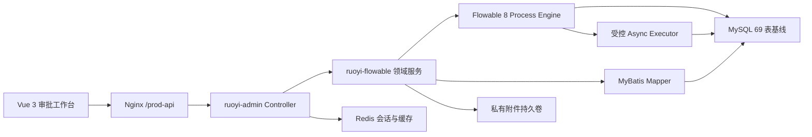

# Flowable 8 审批平台技术方案

## 1. 建设边界

目标工程在当前 RuoYi 前后端分离框架中提供完整审批平台。参考工程用于确认审批功能、页面入口、权限码和 BPMN 扩展约定；目标代码按 Spring Security、Spring 事务、MyBatis、Vue 3 和 Flowable 8 的生产方式实现，不复制框架耦合代码。

平台覆盖：

- 流程分类、表单模板、BPMN 模型、设计器、版本和部署。
- 可发起、我的流程、实例运维、待办、待签、已办、抄送等工作台。
- 发起、认领、取消认领、完成、退回、驳回、委派、委派办结、转办、撤回、取消、终止、挂起和激活。
- 详情、当前变量、提交快照、审批意见、节点轨迹、BPMN Viewer、流程图和导出。
- 用户、角色、部门候选人解析，对象授权，操作审计和职责分离。
- 正式附件上传、配额、绑定、回显、下载、删除和定时清理。
- timer、异步 job、deadletter、监控、备份、发布和回滚。

## 2. 技术基线

| 层级 | 基线 |
| --- | --- |
| JDK | Java 17 |
| Web | Spring Boot 4.0.6、Spring Security、Jakarta Servlet |
| 工作流 | Flowable 8.0.0 Process Engine |
| 持久层 | MyBatis 4.0.1、MySQL 8 |
| 缓存 | Redis 6+ |
| 前端 | Vue 3.5、Vite 6、Element Plus、Pinia |
| BPMN | bpmn-js 18.22.0、本地 Flowable moddle、自建属性面板 |
| 部署 | Nginx、systemd、独立环境文件、持久化附件卷 |

Flowable 变量序列化固定使用 Jackson 2，Spring Web 使用 Boot 4 管理的 Jackson 3。两个 mapper 必须隔离，不能通过依赖降级消除版本差异。

## 3. 运行架构

Controller 只负责协议转换、Bean Validation、URL 权限和操作日志。业务权限、状态校验、事务、Flowable 命令和业务表写入归 `ruoyi-flowable`。

## 4. 模块职责

| 模块 | 职责 |
| --- | --- |
| `ruoyi-admin` | 9 个工作流 Controller、统一响应、下载协议、Web 安全边界 |
| `ruoyi-flowable` | 领域对象、DTO/VO、Mapper、授权器、身份桥、引擎适配和业务服务 |
| `ruoyi-framework` | Spring Security、资源访问过滤、JSON 请求体限制 |
| `ruoyi-system` | 用户、角色、部门、菜单和操作日志主数据 |
| `vite` | 真实 API、14 个业务页面、BPMN 设计/查看和表单运行时 |
| `back/sql/flowable` | 官方 Flowable SQL、六表业务 DDL、53 条菜单与只读验收 |
| `deployment` | Nginx、systemd、生产覆盖配置和环境变量模板 |

## 5. 引擎集成

### 5.1 数据源与事务

- Flowable 和 MyBatis 共同使用若依主数据源与 Spring 事务管理器。
- `wf_*` 写入、附件绑定和 `ACT_*` 引擎命令必须在同一事务中提交或回滚。
- 禁止在领域服务中直接创建独立 JDBC 连接或手工提交事务。
- 生产配置固定 `database-schema-update=false`。

### 5.2 身份

- `WorkflowAuthenticationContext` 在命令前设置真实 Flowable authenticated user，并在正常、异常和嵌套调用后恢复上下文。
- `WorkflowIdentityResolver` 从 `sys_user`、`sys_role`、`sys_dept` 读取有效身份。
- 候选组只接受 `ROLE<id>`、`DEPT<id>` 等已冻结格式，解析后验证存在、启用和去重。
- BPMN 中的办理人、候选人和多实例集合不能直接信任客户端输入。

### 5.3 状态

- 实例运行态来自 Flowable runtime；终态来自历史实例和正式 `processStatus` 变量。
- 自然完成只允许 `running -> completed`。
- 取消、终止等业务终态优先于 Flowable 完成事件，监听器不得覆盖。
- 挂起状态禁止写命令，但授权参与者仍可按对象权限读取详情。
- 重复提交、过期 taskId、非法执行树和并发状态变化统一返回稳定的 `409`。

### 5.4 异步执行

- 测试环境使用真实 executor 验证 timer 自动获取和执行。
- 生产初始配置关闭 executor，完成结构、容量和监控检查后再启用。
- 多实例部署只允许一个经过选主或 Flowable 锁协调验证的 executor 拓扑。
- executable、timer、suspended、deadletter、external worker、history 六类 job 必须持续监控。

## 6. 数据设计

完整数据库为 69 张正式表，其中 Flowable 使用 Process/Common/History 32 张表，项目维护六张业务表。

### 6.1 表单

- `wf_form.content` 保存当前可编辑模板。
- 发布时把表单结构和 `form_id` 固化到 `wf_deploy_form`。
- 已发布流程始终读取部署快照，模板修改不能改变已部署版本。
- 发起和办理按部署 schema 校验字段名、类型、必填、长度、选项、附件和保留变量。

### 6.2 提交快照

- 发起表单安全投影与流程实例在一次引擎命令中写入。
- 任务表单在附件绑定成功后、任务完成前写入 task-local 不可变快照。
- 历史读取先验证元数据行数、类型、作用域、Blob 关系和容量，再读取正文。
- `longString`、`longJson` 和 byte-backed JSON 使用有界解码，拒绝重复字段、尾随根节点和危险属性键。

### 6.3 附件

- `wf_attachment_quota_guard` 先锁全局固定行，再锁用户行，保证容量检查在并发上传下串行一致。
- `wf_attachment` 记录 `TEMP`、`BOUND` 等状态、业务绑定和物理删除时间。
- 文件写入私有目录，文件名由服务端生成，数据库保存受控相对路径。
- 下载必须验证附件状态、流程/任务关系和当前用户对象授权。
- 事务失败、过期临时附件和孤立文件由补偿与调度任务清理。

## 7. 权限模型

五个职责角色：

| 角色 | 主要职责 |
| --- | --- |
| `workflow_admin` | 全部工作流管理、实例运维、状态控制和审计 |
| `workflow_designer` | 分类、表单、模型设计和部署 |
| `workflow_starter` | 查看可发起定义、发起和管理本人流程 |
| `workflow_approver` | 待签、待办、办理和已办查询 |
| `workflow_auditor` | 只读详情、历史、轨迹和抄送审计 |

每个请求同时经过：

1. Spring Security 登录校验。
2. `@PreAuthorize` URL 权限校验。
3. 实例、任务、附件或模型的对象授权。
4. 当前状态和动作合法性校验。
5. 服务端重新解析的身份与数据范围校验。

前端按钮权限只改善交互，不能代替后端门禁。

## 8. 前端架构

- `vite/src/api/workflow` 只封装真实 HTTP 请求。
- `WorkflowProcessList` 统一七类工作台的分页、筛选、日期范围、导出和行操作。
- `ProcessDesigner` 负责 BPMN 编辑、导入、校验、保存和部署入口。
- `ProcessViewer` 根据活动、完成、驳回和终止节点绘制只读轨迹。
- `ProcessFormRenderer` 按白名单 schema 渲染，不执行模板脚本或任意 HTML。
- `WorkflowAttachmentUpload` 使用服务端签发的附件 ID，发起或办理后由后端绑定。
- 页面刷新后必须以 API 和数据库状态为准，不在浏览器本地形成业务状态源。

## 9. 安全边界

- 数据库运行账号仅具备目标 schema 的 `SELECT/INSERT/UPDATE/DELETE`。
- DDL 发布账号和只读验收账号独立管理。
- MySQL、Token、Druid 和其他凭据只从受控环境变量注入。
- BPMN XML 使用安全解析，禁止外部实体和危险扩展。
- JSON 请求体、表单快照、变量正文、导出行数和附件大小均设置服务端上限。
- 生产关闭 Druid 控制台、Flowable REST、IDM 和 Event Registry。
- 附件目录不由通用静态资源处理器公开。

## 10. 可观测性与运维

- HTTP 错误率、P95/P99、连接池、线程、堆、GC、慢 SQL 和锁等待纳入监控。
- 统计运行实例、活动任务、六类 job、deadletter、附件容量和清理失败。
- 关键写操作记录操作人、业务对象、动作、结果、异常和请求关联 ID。
- 每次发布保存 Git commit、JAR、前端产物、SQL 和配置模板 SHA-256。
- 数据库与附件卷执行一致性备份，并定期验证可用性。

## 11. 已冻结兼容设计与待批准非功能输入

动态多实例加签/减签、`multiInstanceHandler`、`${userTaskListener}`、
`startProcessByDefKey` 和复杂执行树动作已按
[06-compatibility-contract.md](06-compatibility-contract.md) 冻结。实现、模型和验收
不得再使用参考工程中的自由脚本、异常吞并或无审计语义。

以下非功能输入仍须在进入 P5 前由发布责任人批准：

1. 多节点 executor 的唯一执行拓扑、节点数量和排空策略。
2. 共享附件存储类型、挂载/访问边界和清理调度唯一执行策略。
3. 生产容量、并发、P95/P99、错误率、72 小时长稳和故障恢复指标。
4. 监控告警平台、值班路由、备份保留和生产发布窗口。

运行任务的物理删除不作为普通审批能力。目标平台使用取消、终止、撤回或受控清理保持运行与历史链完整。

## 12. 生产完成定义

- 参考功能矩阵中的每项能力都有目标实现、明确替代或正式产品决策。
- 页面、API、数据库、流程运行态、历史、审计和附件状态一致。
- 所有审批动作通过正常、越权、非法状态、重复和并发分支验证。
- 复杂 BPMN、动态多实例、timer 和重启续办通过真实环境验证。
- 性能、长稳、故障注入、安全扫描和容量门禁达到批准阈值。
- 两轮全新环境发布彩排结果一致，备份可用性和版本回滚经过真实执行。
- 生产发布、24/72 小时观察和最终签字完成。
