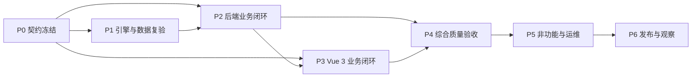

# Flowable 8 审批平台分阶段执行计划

## 1. 执行约定

本计划把生产集成拆为 P0-P6 七个阶段。任务状态统一使用 `pending`、`in_progress`、`completed`、`blocked`、`not executed` 和 `failed`；只有真实服务、真实接口、真实数据库和真实浏览器验证均达到完成门禁，任务才可标记为 `completed`。`not executed` 表示当前交付范围主动后置且尚未执行，不能解释为通过。

### 1.1 当前阶段基线

| 阶段 | 当前状态 | 阶段结果 |
| --- | --- | --- |
| P0 范围与契约冻结 | `in_progress` | 冻结功能、兼容、权限、容量和验收矩阵 |
| P1 引擎与数据基线 | `completed` | 保持 Flowable 8、69 表、共享事务和受控 executor 基线可重复复验 |
| P2 后端业务闭环 | `in_progress` | 核心动作、附件、审计和兼容入口已形成候选；全入口异常与扩展竞态矩阵未闭合 |
| P3 Vue 3 业务闭环 | `in_progress` | 6 个 Chromium spec 已第一次 20/20 通过；连续两次通过门禁尚缺第二次 |
| P4 综合质量验收 | `in_progress` | 五角色 URL 权限矩阵 350/350 已完成；扩展并发、故障注入、权限强化和安全审计 `not executed` |
| P5 非功能与运维 | `not executed` | 性能、长稳、executor、多节点共享附件、监控和恢复门禁当前未执行 |
| P6 发布与观察 | `not executed` | 两轮全新环境彩排、生产发布和 24/72 小时观察当前未执行 |

当前迭代采用业务缺口驱动：真实发起、办理、退回、驳回、撤回、委派、转办、认领、动态加减签、会签/或签和附件链已按受影响编译/定向测试及真实 API 或浏览器主链逐项闭合。候选形成后已集中执行一次完整 Chromium 回归，本轮不再重复运行；该结论不改变 P3 连续两次门禁及 P4-P6 未执行项对“生产集成完成”的约束。

### 1.2 证据和凭据规则

- 每次执行分配唯一 `run-id`，记录 Git commit、JAR、前端产物、SQL、配置模板 SHA-256、环境、时间、执行人和结论。
- Maven、浏览器 E2E、SQL 只读校验、并发、故障、性能和长稳测试均保存机器可读结果及必要截图；敏感输出进入仓库外受控归档。
- 所有测试或彩排生成的账号、随机密码都写入本机 `testcount/accounts.local.md`，记录格式见 [testcount/README.md](../../testcount/README.md)。根目录 `.gitignore` 已忽略 `/testcount/*.local.md`。
- `accounts.local.md` 每条记录包含创建时间、环境、主机、账号别名、真实账号、角色/权限、用途、到期时间、轮换时间和清理状态。随机密码使用密码学安全随机源生成，每个环境、每个账号独立使用。
- 本文、测试代码、控制台日志、截图、缺陷单、提交记录和发布包只使用账号别名，不记录真实账号密码。生产凭据继续由受控密钥或环境变量注入。
- 验证数据使用可追踪业务前缀和清理清单；执行结束后核对流程、任务、附件、审计、job 和测试账号的保留或清理状态。

### 1.3 2026-07-28 候选证据

- 候选 Git 基线为 `12c1991`；候选 JAR 构建成功，打包阶段按计划跳过已单独执行的测试，未重复运行 Maven 全仓回归。
- 候选 Surefire 报告为 `ruoyi-flowable` 607 项（0 失败、0 错误、1 项 Windows 条件跳过）和 `ruoyi-admin` 98/98。Failsafe 首次集中执行发现 5 项问题，修复后按受影响范围定向通过动态多实例 IT `8/8`、生命周期审计契约 `4/4`、RBAC IT `6/6`；未再重复完整 Failsafe。
- 五角色、70 个入口的 HTTP 矩阵为 `350/350`，`failed=0`、`notExecuted=0`；附件 4/4、业务 schema 5/5、兼容契约 5/5 报告保持通过。
- 前端生产构建成功转换 2973 个模块；完整 Chromium 候选回归一次执行 6 个 spec、20 个测试，`20/20 passed`、零跳过、零重试、零 flaky，总耗时 149.43 秒。
- 浏览器回归覆盖发起、审批完成、退回、驳回、撤回、委派/办结、转办、认领/取消认领、动态加减签、ALL 会签、ANY 或签、附件、实例运维、七工作台、十导出和五角色页面权限。
- 从操作审计提取 27 个资源 UUID 对账后，模型、部署、流程定义、字节资源、全部运行/历史流程任务、变量、身份链、事件、job、`wf_deploy_form`、`wf_copy` 及活动表单/分类均为 0；保留表单、分类软删除墓碑各 5 条和相关操作审计 38 条。
- 附件仅保留正式 `DELETED` 审计墓碑 `1bd4d4e0-bfb3-429c-b503-730a4d0b3b7e`，删除时间为 `2026-07-28 15:00:48`；物理文件不存在，清理重试为 0，清理错误为空。
- P3-03 要求连续两次完整通过，本次只完成第一次，因此 P3 继续为 `in_progress`。压力、扩展并发、故障注入、权限强化、监控、备份恢复、生产彩排及 72 小时观察均为 `not executed`，不占当前候选开发排期。

### 1.4 总体依赖

P2 的领域实现与 P3 的页面骨架可以并行；涉及真实状态流转的 P3 E2E 以对应 P2 API 通过为前置。P4 按功能域滚动验收，P5 在功能矩阵稳定后执行，P6 以 P0-P5 全部门禁关闭为前置。

## 2. P0 范围与契约冻结

### P0-01 冻结功能、接口和数据矩阵

- **目标**：建立参考功能到目标实现的唯一验收台账，覆盖 9 个 Controller、70 个入口、60 个前端请求函数、14 个页面、69 张表和 53 条菜单。
- **前置**：`01-technical-solution.md`、`02-feature-mapping.md` 和当前代码盘点结果可用。
- **文件/模块范围**：`docs/workflow-production`、`back/ruoyi-admin`、`back/ruoyi-flowable`、`vite/src/api/workflow`、`vite/src/views/workflow`、`back/sql/flowable`。
- **实施步骤**：1. 为每个页面、API、权限码、服务方法、表和动作分配稳定编号；2. 逐项登记输入、状态前置、对象授权、持久化副作用、异常码和回滚结果；3. 把发起、认领、取消认领、完成、退回、驳回、委派、委派办结、转办、撤回、取消、终止、挂起、激活和终态删除纳入同一动作矩阵；4. 登记七类工作台及十个表格导出入口。
- **真实验证**：从 Spring mapping、Vue 请求函数、菜单 SQL 和 MySQL `information_schema` 分别生成清单并交叉核对；抽取每类入口通过真实 HTTP 请求确认 mapping 与权限码一致。
- **产物**：版本化功能台账、接口清单、数据副作用矩阵和差异清单。
- **完成门禁**：所有目标项都有“目标实现、正式替代或批准排除”结论，数量基线无未解释差异，负责人和验收用例均已分配。
- **依赖/并行关系**：P0 首项；可与 P0-02、P0-03 并行，结果共同作为 P2-P6 输入。

### P0-02 冻结复杂 BPMN 与兼容策略

- **目标**：对动态多实例、`${multiInstanceHandler.getUserIds(execution)}`、`${userTaskListener}`、`startProcessByDefKey` 及复杂执行树动作形成可实现、可测试的正式契约。
- **前置**：完成参考工程源码、BPMN 和 Java 集成点静态盘点；样本不包含业务正文和凭据。
- **文件/模块范围**：参考工程只读样本、`back/ruoyi-flowable` 的模型/任务/流程服务、`vite/src/components/workflow`、BPMN fixture 与兼容契约文档。
- **实施步骤**：1. 将动态多实例定义为服务端解析有效用户、冻结集合快照、受控加签/减签、完整审计和同事务更新；2. 将 `multiInstanceHandler` 定义为白名单 Spring Bean，只读取批准变量并通过正式身份解析器返回去重启用用户；3. 将 `userTaskListener` 定义为兼容 Bean，只处理批准事件并调用领域服务，不执行任意脚本、不覆盖取消/终止/驳回等业务终态；4. 将 `startProcessByDefKey` 定义为服务层兼容入口，解析最新激活定义后复用按 definitionId 发起的权限、表单、变量、附件和审计链；5. 冻结复杂移动策略：并行/多实例驳回采用整实例原子终止并保留 `rejected`，退回仅支持可证明唯一且同一安全作用域的目标，撤回仅支持全部直接后继尚未处理且执行树可原子恢复的场景，其余明确返回 `409` 且零副作用。
- **真实验证**：用参考 BPMN 样本完成导入、保存、重开、部署和真实执行；为每个支持及拒绝分支准备可重复实例并核对 runtime、history、变量、comment 和审计日志。
- **产物**：兼容决策记录、BPMN 支持矩阵、动作状态机、样本清单和异常码契约。
- **完成门禁**：四项兼容能力及并行/多实例动作均有确定语义、权限、审计、失败行为和验收用例，不保留“实现时再决定”的开放项。
- **依赖/并行关系**：依赖 P0-01 的编号规则；直接阻塞 P2-01、P2-02、P2-03 和 P3-01。

### P0-03 冻结验收数据、容量目标和证据规范

- **目标**：形成可由不同执行人重复运行的环境、账号、数据、SLO、证据和清理规范。
- **前置**：测试、预生产和生产拓扑信息已确认；账号保管责任人已指定。
- **文件/模块范围**：`testcount/README.md`、本机忽略文件 `testcount/accounts.local.md`、测试数据设计、CI/验收配置和仓库外证据归档。
- **实施步骤**：1. 定义五角色及对象所有者、非参与者、停用用户、跨部门用户等账号别名；2. 所有生成账号和随机密码只写入 `testcount/accounts.local.md`；3. 定义串行、条件、并行、会签、或签、timer、异步和附件流程 fixture；4. 冻结目标并发量、数据规模、P95/P99、错误率、恢复时间、72 小时长稳和发布窗口阈值；5. 定义证据目录、命名、脱敏、保留和签字流程。
- **真实验证**：由第二位执行人仅凭规范创建一套隔离测试数据并完成登录、角色校验和清理；扫描 Git 暂存区、报告和日志确认不含真实密码。
- **产物**：账号别名矩阵、数据字典、容量画像、SLO、证据模板和清理清单。
- **完成门禁**：所有后续任务可引用稳定账号别名与数据 fixture；阈值已获批准；凭据只存在受控位置且清理责任明确。
- **依赖/并行关系**：可与 P0-01、P0-02 并行；P3-03、P4、P5、P6 均依赖本任务。

## 3. P1 引擎与数据基线复验

### P1-01 复验 Flowable 8 与 69 表空库基线

- **目标**：确认全新 MySQL 8 环境可按固定 SQL 顺序建立若依、Quartz、Flowable 8 和六张 `wf_*` 正式表，应用不执行自动建表。
- **前置**：空 schema、DDL 账号、应用 DML 账号和只读验收账号已按 P0-03 准备。
- **文件/模块范围**：`back/sql/flowable`、若依/Quartz 基线 SQL、`back/ruoyi-admin/src/main/resources`、`deployment/config`。
- **实施步骤**：1. 校验所有 SQL SHA-256；2. 依次执行若依 20 表、Quartz 11 表、Flowable 32 表、业务 6 表和菜单脚本；3. 使用应用账号启动且保持 `flowable.database-schema-update=false`；4. 执行三份只读验收 SQL；5. 复验应用账号无 DDL 权限。
- **真实验证**：在空库真实执行初始化、应用启动、定义部署、实例发起和任务完成；查询 `information_schema`、`ACT_*`、`wf_*` 和菜单角色映射，保存只读输出。
- **产物**：SQL 执行记录、69 表清单、校验和、账号权限结果和启动日志。
- **完成门禁**：空库安装可重复成功，表/索引/约束/菜单数量准确，应用无自动 DDL 且最小权限运行正常。
- **依赖/并行关系**：依赖 P0-01、P0-03；完成后解锁 P1-02、P1-03 和 P2 数据写链。

### P1-02 复验共享事务、身份和序列化边界

- **目标**：确认 Flowable `ACT_*` 与 MyBatis `wf_*` 使用同一 Spring 事务，身份上下文和 Jackson 2/3 隔离稳定。
- **前置**：P1-01 完成，真实 MySQL、Redis 和附件临时目录可用。
- **文件/模块范围**：`back/ruoyi-flowable` 的 engine、identity、process、task、attachment 服务，`back/ruoyi-admin` 集成测试及配置。
- **实施步骤**：1. 执行发起、任务提交快照、抄送和附件绑定成功链；2. 在每个写链的引擎动作前后注入受控异常；3. 验证 authenticated user 正常、异常和嵌套调用后恢复；4. 验证 Flowable Jackson 2 变量与 Web Jackson 3 DTO 互不串用；5. 重启后读取历史变量和附件关系。
- **真实验证**：真实事务中比较成功前后 `ACT_*`、`wf_*`、文件系统和审计记录；异常用例要求全部回滚或由正式补偿完成，页面刷新结果与数据库一致。
- **产物**：事务原子性报告、身份上下文报告、序列化兼容样本和重启读取证据。
- **完成门禁**：不存在半提交、身份串线、变量不可读或附件孤儿；所有失败均返回稳定错误并具有可追踪日志。
- **依赖/并行关系**：依赖 P1-01；可与 P1-03 并行，是 P2 全部写动作的基础门禁。

### P1-03 复验 timer、job 与 executor 基线

- **目标**：建立 executor 关闭、单节点启用和异常恢复三种可重复基线。
- **前置**：P1-01 完成，具备 timer/async BPMN fixture 和独立测试环境。
- **文件/模块范围**：Flowable engine 配置、`deployment/config`、job 监控查询、相关 Failsafe 集成测试。
- **实施步骤**：1. 确认默认配置关闭 executor；2. 在隔离环境单节点启用并执行 timer、async、suspended、deadletter 和 history job；3. 在获取、执行和提交阶段重启进程；4. 执行失败重试、deadletter 转移和人工恢复；5. 记录锁、重试和队列指标。
- **真实验证**：真实等待 timer 到期并核对任务自动创建/完成；进程重启后 job 继续且业务副作用恰好一次；deadletter 可告警、可定位、可恢复。
- **产物**：executor 基线配置、job 状态报告、重启恢复证据和监控指标字典。
- **完成门禁**：executor 关闭时无后台执行，启用时无重复副作用，重启与失败恢复达到 P0-03 阈值。
- **依赖/并行关系**：依赖 P1-01；可与 P1-02 并行，并作为 P5-02 集群和长稳测试基线。

## 4. P2 后端业务闭环

### P2-01 实现监听器与按定义 key 发起兼容

- **目标**：完成受控 `userTaskListener` 和 `startProcessByDefKey` 兼容链，同时保持现有按 definitionId 发起契约稳定。
- **前置**：P0-02 兼容策略冻结，P1-02 事务和身份基线通过。
- **文件/模块范围**：`back/ruoyi-flowable` 的 process、engine、listener/identity 服务与测试；必要的 `ruoyi-admin` Controller/DTO；BPMN 样本。
- **实施步骤**：1. 建立 Spring Bean 名称为 `userTaskListener` 的白名单监听入口，显式处理批准事件并转发领域服务；2. 对终态变量采用“不覆盖已确定业务终态”的状态规则；3. 在流程服务增加 `startProcessByDefKey`，解析租户/分类范围内最新激活定义后调用现有标准发起链；4. 外部 Java 调用存在时保持稳定方法签名，HTTP 暴露仅复用现有登录、URL 权限和对象权限；5. 补正常、重复、停用身份、无激活定义、监听器异常和事务回滚测试。
- **真实验证**：部署包含 `${userTaskListener}` 的参考 BPMN，通过 key 发起真实实例，完成任务并核对变量、历史、comment、附件和操作日志；异常时实例与业务表保持一致。
- **产物**：兼容服务、契约测试、真实引擎 IT、调用迁移说明和审计样本。
- **完成门禁**：参考样本可真实运行；key 与 ID 两条发起路径结果一致；监听器无任意表达式执行能力且不会覆盖业务终态。
- **依赖/并行关系**：依赖 P0-02、P1-02；可与 P2-02 并行，P3-01 和 P3-03 使用其部署样本。

### P2-02 实现动态多实例与 multiInstanceHandler

- **目标**：完成会签/或签的服务端候选集合解析、动态加签、动态减签、完成条件、审计和事务一致性。
- **前置**：P0-02 已冻结多实例变量、权限、加减签边界和异常码；P1-02 通过。
- **文件/模块范围**：`back/ruoyi-flowable` 的 task、process、identity、engine 服务及 DTO/VO/测试，`ruoyi-admin` 任务入口，菜单权限 SQL，BPMN fixture。
- **实施步骤**：1. 提供白名单 Bean `multiInstanceHandler`，通过正式用户主数据解析批准变量并返回有序、去重、启用用户；2. 冻结多实例集合、完成数量和操作 revision，防止客户端直接改引擎计数变量；3. 加签只创建有效且未重复的实例，减签只处理未完成且有权限的实例，并保持至少一个合法办理路径；4. 完成条件按会签/或签契约计算，已完成实例不被回写；5. 将加签、减签、完成和拒绝写入结构化 Flowable comment、操作日志和必要业务快照；6. 对重复、停用用户、并发加减签、过期 executionId 和写后状态不一致返回稳定 `400/409` 并回滚。
- **真实验证**：在真实 Flowable 引擎中执行串行前后、多实例进行中、部分完成、全部完成、或签提前完成、并发加签和并发减签；核对 runtime execution/task、history、变量、comment 和用户可见任务。
- **产物**：多实例领域服务、API、权限码、BPMN 样本、单元/集成/并发测试和状态对账报告。
- **完成门禁**：支持矩阵所有场景真实通过，非法集合在引擎动作前拒绝，并发结果唯一且无孤立 execution、重复任务或审计缺口。
- **依赖/并行关系**：依赖 P0-02、P1-02；与 P2-01 可并行，完成后解锁 P2-03、P3-01、P3-02 和 P4-02。

### P2-03 闭合并行/多实例退回、驳回和撤回

- **目标**：按冻结策略实现复杂执行树的安全动作，支持可证明正确的路径并稳定拒绝歧义路径。
- **前置**：P0-02 动作状态机冻结，P2-02 多实例运行结构稳定。
- **文件/模块范围**：`WorkflowTaskLifecycleService`、任务移动策略、Flowable engine adapter、流程状态归一化、相关 Controller/DTO、BPMN 测试模型。
- **实施步骤**：1. 在命令前读取并冻结 execution tree、活动任务、历史目标和 revision；2. 退回只移动同一安全作用域内唯一可达目标，存在活动兄弟分支、跨多实例边界或目标不唯一时返回 `409`；3. 驳回采用整实例原子终止，取消全部活动兄弟与多实例 execution，并持久化唯一 `rejected` 终态；4. 撤回要求操作人真实完成前驱且全部直接后继未认领、未办理、未派生不可逆副作用，满足时原子恢复，不满足时返回 `409`；5. 写后重新查询 runtime、history、状态变量和活动任务，任何漂移抛异常驱动事务回滚；6. 保留完整审批意见和操作审计。
- **真实验证**：执行排他、并行分叉/汇聚、会签部分完成、或签提前完成、后继已认领/已完成及并发动作模型；成功分支核对完整执行树，拒绝分支核对零副作用。
- **产物**：复杂移动实现、状态机测试、真实 Flowable IT、执行树对账工具和验收报告。
- **完成门禁**：每个并行/多实例场景都有成功或明确拒绝结论；无残留活动任务、幽灵 execution、终态覆盖或历史链断裂。
- **依赖/并行关系**：依赖 P2-02；可与 P2-04 的查询导出工作并行，阻塞 P3-02、P3-03 和 P4-02。

### P2-04 闭合全部接口、附件、导出和审计链

- **目标**：使 70 个入口在真实权限、对象授权、状态校验、正式持久化、审计和异常分支上形成完整后端闭环。
- **前置**：P1-02 完成；复杂动作分别等待 P2-02、P2-03。
- **文件/模块范围**：9 个工作流 Controller、`ruoyi-flowable` 领域服务/Mapper、六张 `wf_*` 表、十个表格导出、附件存储与清理任务。
- **实施步骤**：1. 逐项闭合分类、表单、模型、部署、七类工作台、详情、流程图和身份查询；2. 对全部动作补参数、URL 权限、对象授权、状态、重复和异常校验；3. 保持 `ACT_*`、`wf_*`、附件文件和操作日志同事务或正式补偿；4. 对七类工作台导出及分类、表单、模型导出复用与列表相同的数据范围和过滤条件；5. 验证 XML、流程图、附件下载的内容类型、文件名、限额和对象授权；6. 补直接 API 和真实数据库集成测试。
- **真实验证**：使用五角色真实 Token 调用全部入口；写接口前后查询数据库和文件存储，导出使用结构化 XLSX/XML 解析器核对表头、行数、过滤和数据隔离。
- **产物**：接口闭环清单、Controller/领域/Mapper 测试、导出契约、附件一致性报告和审计对账。
- **完成门禁**：70 个入口均有正向、越权、非法状态和关键异常证据；成功结果真实持久化，失败结果无业务副作用。
- **依赖/并行关系**：查询类可在 P2-01 至 P2-03 期间并行；动作类随对应领域任务完成滚动关闭，整体完成后解锁 P4-01。

## 5. P3 Vue 3 业务闭环

### P3-01 完成复杂 BPMN 设计与往返一致性

- **目标**：让设计器可安全配置、导入、保存、重开和部署动态多实例、监听器、条件和并行模型。
- **前置**：P0-02 属性契约冻结；P2-01、P2-02 提供可执行后端语义和样本。
- **文件/模块范围**：`vite/src/components/workflow/ProcessDesigner.vue`、本地 Flowable moddle、属性面板、`vite/src/views/workflow/model` 及同名组件文档。
- **实施步骤**：1. 为会签/或签、集合变量、元素变量、完成条件和 `multiInstanceHandler` 提供受控控件；2. 为 `userTaskListener` 提供批准事件和固定 Bean 选择，不接受任意脚本文本；3. 保持 assignee、candidateUsers、candidateGroups、formKey、条件流和并行网关现有能力；4. 导入参考 XML 后保留命名空间和受支持扩展；5. 保存前执行结构、表达式白名单、身份和表单引用校验；6. 更新复杂公共组件文档与最小接入示例。
- **真实验证**：浏览器中完成“导入参考 XML -> 编辑 -> 保存 -> 刷新重开 -> 部署 -> 发起 -> 实际流转”；对保存前后 XML 做结构化比较并核对 Flowable 真实执行。
- **产物**：设计器实现、moddle 契约、组件文档、往返 fixture 和浏览器证据。
- **完成门禁**：支持矩阵内属性无丢失、无错误改写且部署可执行；不支持表达式在保存前给出明确业务提示。
- **依赖/并行关系**：依赖 P0-02，页面开发可与 P2-01/P2-02 后半程并行，真实执行验收等待后端完成。

### P3-02 完成全部动作和状态交互

- **目标**：在真实详情页和工作台提供全部有权动作、参数选择、确认、结果回显和异常恢复。
- **前置**：P2 对应动作 API 完成，五角色菜单和按钮权限可加载。
- **文件/模块范围**：`vite/src/views/workflow/work`、`vite/src/api/workflow`、`ProcessFormRenderer`、`ProcessViewer`、`WorkflowAttachmentUpload`、`WorkflowProcessList` 及组件文档。
- **实施步骤**：1. 接入发起、认领、取消认领、完成、退回、驳回、委派、委派办结、转办、撤回、取消、终止、挂起、激活、终态删除以及动态加签/减签；2. 使用身份选择器提交真实用户 ID，支持抄送人和动态下一办理人；3. 按后端可用动作和权限显示控件，提交时带 revision/必要状态前置；4. 成功后重新请求详情、工作台、轨迹、变量、附件和审批意见；5. `400/403/404/409/500` 使用稳定提示并保留用户可恢复输入；6. 页面刷新只依赖服务端状态。
- **真实验证**：在真实浏览器、后端、MySQL、Redis 和附件存储上逐动作执行；每次操作后刷新页面并与 API、数据库、运行态和历史对账。
- **产物**：完整页面交互、API 调用、组件文档、动作截图/录像和状态对账记录。
- **完成门禁**：全部动作有真实入口且无本地模拟状态；有权动作可完成，无权或非法状态动作无副作用并正确回显。
- **依赖/并行关系**：按 P2-02、P2-03、P2-04 完成度滚动接入；与 P3-01 可并行，完成后进入 P3-03。

### P3-03 建立全部动作与导出浏览器 E2E

- **目标**：建立可重复自动运行的真实浏览器 E2E，覆盖全部动作、七类工作台、十个表格导出及文件下载。
- **前置**：P0-03 测试账号和 fixture 可用；P3-01、P3-02 完成；后端、MySQL、Redis、Nginx 和附件存储真实运行。
- **文件/模块范围**：正式 Playwright E2E 工程、`vite` 测试脚本、浏览器 fixture、仓库外报告归档；应用代码仅在 E2E 暴露真实缺陷时按对应任务修复。
- **实施步骤**：1. 用 `workflow_admin`、`workflow_designer`、`workflow_starter`、`workflow_approver`、`workflow_auditor` 账号别名登录；2. 覆盖 P3-02 全部动作及动态多实例；3. 覆盖可发起、我的流程、实例运维、待办、待签、已办、抄送的分页、筛选、详情和刷新；4. 下载并解析 `startExport`、`ownExport`、`manageExport`、`todoExport`、`claimExport`、`finishedExport`、`copyExport`、分类、表单、模型十个 XLSX；5. 验证 BPMN XML、流程图和附件下载；6. 每条用例通过 API 或只读 SQL 复核真实副作用，保留 trace、视频和下载摘要。
- **真实验证**：从空测试数据开始运行完整浏览器套件，不拦截或伪造工作流 API；XLSX 使用解析器核对列、行、过滤条件和角色数据范围，文件下载核对 MIME、文件名、大小和 SHA-256。
- **产物**：E2E 用例、fixture、执行脚本、JUnit/HTML 报告、trace/视频索引和数据库对账结果。
- **完成门禁**：全动作、全工作台和全部导出连续两次通过；无 mock、无跳过、无重试掩盖，失败能定位到页面、API、状态或数据层。
- **当前状态**：第一次候选回归已于 2026-07-28 以 6 个 spec、20/20 通过；第二次独立执行尚未进行，任务保持 `in_progress`。
- **依赖/并行关系**：依赖 P3-01、P3-02 和 P0-03；可按功能域与 P4-01 滚动并行，最终报告是 P4 和 P6 输入。

## 6. P4 综合质量验收

### P4-01 执行五角色全接口权限矩阵

- **目标**：对五个职责角色和全部 70 个入口完成 URL 权限、对象授权、状态授权和数据范围验收。
- **前置**：P2-04 完成，P0-03 账号别名与对象数据 fixture 可用。
- **文件/模块范围**：Spring Security、9 个 Controller、对象授权服务、菜单/角色 SQL、API 测试与浏览器权限测试。
- **实施步骤**：1. 建立至少 `5 x 70`（350 个单元格）的直接 API 矩阵；2. 每格标记应允许、应 `403`、对象不可见 `403/404` 或非法状态 `409`；3. 验证页面、按钮和直接 API 三层一致；4. 使用本人实例、参与实例、抄送实例、跨部门实例和无关实例验证对象边界；5. 管理员专属实例运维查询/导出与设计者专属管理能力单独核验；6. 对拒绝请求检查数据库、引擎和文件零副作用。
- **真实验证**：五个真实账号逐接口调用，保留 HTTP 状态、响应摘要、审计 ID 和只读数据差异；浏览器直接输入 URL 与隐藏按钮场景一并验证。
- **产物**：完整权限矩阵、API 运行报告、菜单对账、对象授权证据和缺陷关闭记录。
- **完成门禁**：矩阵无空白单元格；所有应允许请求成功形成正确业务结果，所有拒绝请求状态稳定且零副作用。
- **依赖/并行关系**：依赖 P2-04；可与 P3-03 按角色并行，最终结果共同进入 P4-04。

### P4-02 执行并发与幂等矩阵

- **目标**：验证同任务、同实例、同附件、同多实例集合和同 job 上的竞态结果唯一、一致且可解释。
- **前置**：P2-02、P2-03、P2-04 完成；P0-03 并发规模和判定阈值已批准。
- **文件/模块范围**：任务/实例/附件/抄送领域服务、Flowable revision、数据库唯一键与锁、并发集成测试和负载脚本。
- **实施步骤**：1. 以同步屏障并发执行认领、取消认领、完成、退回、驳回、委派、委派办结、转办、撤回、取消、终止、挂起/激活和终态删除；2. 并发执行多实例加签/减签/完成；3. 并发上传、绑定、删除同一附件及触发配额边界；4. 并发执行相同导出和查询，确认不改变状态；5. 记录成功数、`409` 数、revision、锁等待和最终数据；6. 重放重复请求验证幂等键和唯一约束。
- **真实验证**：真实多线程 HTTP/服务调用和真实 MySQL 事务；每轮后对账活动任务、execution、历史、comment、`wf_*`、附件文件和操作日志。
- **产物**：并发场景集、机器可读结果、锁与慢 SQL 报告、最终状态快照和缺陷修复证据。
- **完成门禁**：竞争动作只有契约允许的成功数，其余返回稳定冲突；无双重完成、重复抄送、超额附件、丢失审计或状态漂移。
- **依赖/并行关系**：依赖 P2-02、P2-03；可与 P4-01 按独立环境并行，结论是 P5 容量模型输入。

### P4-03 执行故障注入和事务恢复矩阵

- **目标**：证明数据库、应用、Redis、附件存储和 executor 异常下业务可回滚、可补偿、可恢复。
- **前置**：P1-02、P1-03 和 P4-02 通过；具备可隔离、可重置的故障测试环境。
- **文件/模块范围**：Spring 事务、连接池、附件补偿、executor/job、部署配置、恢复脚本和故障注入套件。
- **实施步骤**：1. 在引擎动作前、引擎动作后业务表写入前、业务表写入后提交前注入异常；2. 注入 MySQL 断连、死锁、锁超时和只读切换；3. 注入 Redis 不可用并验证已有会话与新登录边界；4. 注入附件卷只读、空间不足、原子移动失败和清理任务中断；5. 在 job 获取、执行、重试和提交阶段终止应用；6. 恢复依赖后执行自动/人工恢复并对账。
- **真实验证**：每个注入点通过真实服务执行，不以 mock 代替基础设施故障；恢复后重新查询页面、API、数据库、文件和 job 队列，确认无半提交与重复副作用。
- **产物**：故障注入脚本、恢复步骤、RTO/RPO 实测值、数据对账和告警记录。
- **完成门禁**：所有场景达到批准的恢复目标；补偿项有确定 owner 和告警；不存在需要手工改表才能恢复的正常发布路径。
- **依赖/并行关系**：依赖 P4-02 和 P1-03；可与 P4-01 独立并行，输出进入 P5-04 和 P6 彩排。

### P4-04 执行全量回归、安全和证据审计

- **目标**：形成进入非功能验收前的单一质量基线，确保功能、权限、安全和文档一致。
- **前置**：P3-03、P4-01、P4-02、P4-03 完成。
- **文件/模块范围**：全仓 Maven 测试、Failsafe IT、前端构建/E2E、SQL 契约、依赖与安全扫描、生产文档。
- **实施步骤**：1. 在 `back` 执行 `mvn clean verify`；2. 在 `vite` 执行锁文件安装、生产构建和完整 E2E；3. 执行 SQL DDL/菜单契约和三份只读验收；4. 扫描依赖、BPMN/XML/JSON/上传下载边界、敏感信息和最小权限；5. 核对测试跳过、失败重试和报告数量；6. 更新功能台账状态和证据索引。
- **真实验证**：完整测试连接隔离的真实 MySQL、Redis、Flowable、Nginx 和附件存储；抽样复核报告对应的真实数据库副作用。
- **产物**：Maven/Failsafe/E2E/构建/扫描报告、SQL 输出、证据索引和签字记录。
- **完成门禁**：失败、错误和未批准跳过均为零；高危/严重安全问题为零；功能台账、代码、权限和证据完全对应。
- **依赖/并行关系**：汇总 P3 和 P4 全部任务；完成后统一解锁 P5。

## 7. P5 非功能与运维验收

### P5-01 执行性能、容量和峰值测试

- **目标**：验证批准容量画像下查询、动作、导出、附件和复杂多实例满足 P95/P99、吞吐和错误率目标。
- **前置**：P4-04 通过；环境规格、数据规模和 SLO 已在 P0-03 冻结。
- **文件/模块范围**：Nginx、JVM、连接池、MySQL、Redis、Flowable、附件存储、性能脚本和监控面板。
- **实施步骤**：1. 构造批准规模的定义、实例、任务、历史、抄送和附件数据；2. 分别压测七类工作台、详情、十个导出、上传下载和全部高频动作；3. 压测并行、多实例和 timer/async 混合负载；4. 逐级升压至目标、峰值和保护阈值；5. 采集 P50/P95/P99、吞吐、错误率、GC、线程、连接池、慢 SQL、锁和磁盘；6. 完成索引、分页、批量和配置优化后重复基线。
- **真实验证**：使用与生产同构或经批准折算的环境真实执行，导出与附件下载校验完整内容，压测后对账业务数据和 job 队列。
- **产物**：负载模型、性能报告、容量上限、调优记录、资源曲线和扩容建议。
- **完成门禁**：目标负载达到批准 SLO，峰值下保护机制生效且数据一致；无未解释资源饱和、错误突增或积压。
- **依赖/并行关系**：依赖 P4-04；结果为 P5-02、P5-03 配置和 P6 发布容量输入。

### P5-02 执行 executor 集群与 72 小时长稳

- **目标**：验证批准 executor 拓扑、timer/async 处理、失败重试和应用长时间运行稳定性。
- **前置**：P1-03 单节点基线、P5-01 容量参数和 executor 选主/锁协调方案可用。
- **文件/模块范围**：Flowable async executor 配置、多节点部署、六类 job 监控、长稳脚本和告警规则。
- **实施步骤**：1. 先保持生产初始 executor 关闭并验证零后台执行；2. 按批准拓扑启用一个逻辑执行主体，验证多节点不会重复获取；3. 持续产生 timer、async、suspended、deadletter、external worker 和 history job；4. 在 72 小时内滚动重启节点、制造可恢复失败并观察重试；5. 监控堆、线程、连接、锁、队列深度、吞吐和延迟趋势；6. 验证停用 executor、排空队列和恢复启用流程。
- **真实验证**：72 小时真实运行期间持续创建和完成实例，定时抽样核对 job 与业务副作用；结束后队列回落、内存和线程无持续增长。
- **产物**：executor 拓扑、72 小时曲线、job 对账、告警演练、启停和排空步骤。
- **完成门禁**：无重复执行、丢 job、不可恢复 deadletter、内存/线程/连接泄漏；队列延迟和恢复时间达到批准阈值。
- **依赖/并行关系**：依赖 P5-01 和 P1-03；可与 P5-03 在同一多节点环境协同执行。

### P5-03 验证共享附件存储和唯一清理调度

- **目标**：让任意应用节点均可安全上传、绑定、下载和清理附件，并保证清理任务只产生一次业务效果。
- **前置**：P5-01 给出附件容量和吞吐；共享 POSIX 持久卷或批准的对象存储方案已准备。
- **文件/模块范围**：附件 storage/service、`deployment` 挂载与权限、Nginx 下载边界、清理调度和分布式唯一执行机制。
- **实施步骤**：1. 所有节点使用同一受控存储命名空间和服务端生成相对路径；2. 保持临时写入、校验、原子发布和数据库绑定顺序；3. 通过节点 A 上传、节点 B 绑定/下载、节点 C 清理验证节点无关性；4. 并发上传同名原文件、滚动重启和节点故障；5. 使用数据库锁或批准的调度锁保证过期 TEMP、孤立文件和物理删除清理唯一执行；6. 将数据库与附件卷纳入一致性备份恢复。
- **真实验证**：真实多节点和共享存储执行跨节点链路，核对 SHA-256、权限、配额、数据库状态和文件存在性；恢复备份后再次下载校验。
- **产物**：共享存储配置、跨节点测试、清理唯一性报告、容量告警和备份恢复记录。
- **完成门禁**：任意健康节点可提供完整附件链；无静态目录绕过授权、重复清理、丢文件、孤儿或配额漂移。
- **依赖/并行关系**：依赖 P5-01；可与 P5-02 同步执行节点切换，完成后进入 P5-04。

### P5-04 完成监控、告警、备份和恢复演练

- **目标**：建立覆盖用户请求、流程引擎、数据库、executor、附件和发布的可运营体系。
- **前置**：P4-03 故障结果、P5-01 性能基线、P5-02 executor 指标和 P5-03 存储方案完成。
- **文件/模块范围**：监控平台、日志、告警路由、数据库/附件备份、`deployment` 配置和生产 runbook。
- **实施步骤**：1. 建立 HTTP 错误率与 P95/P99、JVM、连接池、慢 SQL、锁等待、实例/任务、六类 job、deadletter、附件容量和清理失败指标；2. 为关键写动作关联 request-id、操作人、对象、动作、结果和异常；3. 配置分级告警、值班路由、抑制和恢复通知；4. 执行数据库与附件一致性备份、校验和恢复；5. 演练应用版本回滚、配置回滚、executor 停止/排空和依赖恢复；6. 将实测 RTO/RPO 写入 runbook。
- **真实验证**：主动触发每类告警并确认送达、定位和恢复；从备份恢复到隔离环境并运行只读 SQL、登录、详情和附件下载验收。
- **产物**：监控面板、告警规则、值班手册、备份清单、恢复报告和回滚步骤。
- **完成门禁**：关键故障均可在目标时间内发现、定位、恢复；备份可恢复且业务/附件对账通过。
- **依赖/并行关系**：汇总 P5-01 至 P5-03；完成后解锁 P6。

## 8. P6 发布彩排、上线与观察

### P6-01 准备可重复发布包和 Go/No-Go 清单

- **目标**：形成不依赖个人记忆的发布、验收、回滚和凭据交接包。
- **前置**：P0-P5 完成，P4-04 全量基线仍为绿色。
- **文件/模块范围**：JAR、前端静态产物、SQL、`deployment`、生产 runbook、监控/备份配置和仓库外发布证据。
- **实施步骤**：1. 固定 Git commit 和全部产物 SHA-256；2. 冻结环境变量名、最小权限账号、端口、目录、共享卷和 executor 初始关闭策略；3. 准备安装、健康检查、69 表只读验收、五角色冒烟、备份恢复和版本回滚命令；4. 所有彩排账号与随机密码写入 `testcount/accounts.local.md`，发布文档仅引用别名；5. 定义变更窗口、执行人、复核人、回滚决策点和沟通路径。
- **真实验证**：由未参与编写的执行人对发布包做离线校验并在隔离主机完成预检查；逐项确认命令、路径、权限和回滚介质可用。
- **产物**：签名发布包、SHA-256 清单、Go/No-Go 表、执行时间表、账号别名清单和回滚包。
- **完成门禁**：发布包不可变、步骤无占位项、责任明确、回滚介质可用，所有凭据均通过受控位置注入。
- **依赖/并行关系**：依赖 P5-04 和 P4-04；完成后开始第一轮彩排。

### P6-02 第一轮全新环境发布彩排

- **目标**：在全新环境完整执行安装、初始化、发布、验收、备份和回滚，发现并关闭流程缺口。
- **前置**：P6-01 通过；准备空 MySQL schema、空 Redis 命名空间、空共享附件目录和独立主机/节点。
- **文件/模块范围**：完整发布包、SQL、Nginx、systemd、MySQL、Redis、共享附件、监控、executor 和 E2E。
- **实施步骤**：1. 从零安装配置并建立 69 表和 53 条菜单；2. 部署后端、前端、Nginx、共享附件和监控，保持 executor 初始关闭；3. 运行只读 SQL、五角色全接口冒烟、全动作核心链和十个导出；4. 按门禁启用 executor 并验证 timer/async；5. 创建数据库与附件一致性备份；6. 执行应用版本回滚和数据/附件恢复；7. 记录每步耗时、人工判断和改进项。
- **真实验证**：整轮使用真实基础设施和浏览器，使用全新独立测试数据与附件卷；回滚后再次执行登录、发起、办理、历史、导出和附件下载。
- **产物**：第一轮时间线、命令输出、E2E/SQL/监控证据、备份恢复结果和改进清单。
- **完成门禁**：安装、运行、executor、备份和回滚均完成；发现项均有负责人、优先级、修复方案和复验条件。
- **依赖/并行关系**：依赖 P6-01；结果进入 P6-03，第一轮结束前不开始第二轮。

### P6-03 完成彩排整改和发布冻结

- **目标**：关闭第一轮全部发布阻断并生成第二轮使用的独立、不可变候选包。
- **前置**：P6-02 完成，改进清单和证据齐全。
- **文件/模块范围**：第一轮发现涉及的必要代码、SQL、配置、测试和 runbook；发布候选制品。
- **实施步骤**：1. 逐项修复并补自动回归；2. 对命令、默认值、权限、监控和回滚步骤进行文档化；3. 重新执行受影响的 P4/P5 门禁；4. 生成新 commit、制品和 SHA-256；5. 冻结第二轮输入并安排独立执行人与复核人。
- **真实验证**：每个发现项在隔离环境复现失败并验证修复；相关全量回归、性能或故障测试保持通过。
- **产物**：关闭后的改进清单、回归证据、第二轮候选包、差异说明和更新后的 Go/No-Go 表。
- **完成门禁**：第一轮高/中风险项全部关闭，低风险接受项有正式审批；第二轮无临时补丁和未记录手工步骤。
- **依赖/并行关系**：依赖 P6-02；完成后才能开始 P6-04。

### P6-04 第二轮独立全新环境发布彩排

- **目标**：由独立执行人证明发布包和 runbook 可重复、可在窗口内完成并可可靠回滚。
- **前置**：P6-03 完成；使用另一套空数据库、空 Redis、空共享附件目录和清洁节点。
- **文件/模块范围**：冻结候选包及 P6-02 同等完整范围。
- **实施步骤**：1. 独立执行人严格按 runbook 从零部署；2. 完整运行 69 表/菜单验收、五角色接口冒烟、全动作核心链、十个导出、跨节点附件和 executor；3. 执行一致性备份和版本回滚；4. 记录总时长、各阶段耗时、告警、资源和任何文档外操作；5. 对两轮结果做差异分析并召开 Go/No-Go 评审。
- **真实验证**：第二轮不复用第一轮数据库、缓存、附件和进程状态；全部证据重新生成，回滚后业务与附件可读取。
- **产物**：第二轮完整报告、两轮差异、窗口时长、最终 Go/No-Go 结论和签字。
- **完成门禁**：第二轮零未记录手工步骤、零发布阻断、结果与第一轮整改后基线一致，时长满足窗口且回滚真实成功。
- **依赖/并行关系**：严格依赖 P6-03；通过后解锁 P6-05 生产发布。

### P6-05 生产发布和 24/72 小时观察

- **目标**：按批准窗口完成生产发布，稳定启用能力并以观测数据完成最终验收。
- **前置**：P6-04 Go 结论为通过，变更审批、备份、值班和回滚负责人就绪。
- **文件/模块范围**：生产 Nginx、systemd、应用、MySQL、Redis、共享附件、监控告警和 executor。
- **实施步骤**：1. 执行发布前备份和校验；2. 按冻结包发布并完成健康检查、SQL 只读验收和五角色最小冒烟；3. 在批准门禁后按既定拓扑启用 executor；4. 观察请求、错误、P95/P99、数据库、job、deadletter、附件和清理指标；5. 在 24 小时和 72 小时分别复核业务、审计、容量和告警；6. 更新测试/彩排账号清理状态并完成交接。
- **真实验证**：生产仅执行批准的低风险冒烟和只读对账；真实业务样本由授权人员确认页面、状态、历史、审计和附件一致。
- **产物**：生产发布时间线、健康与只读验收、24/72 小时观察报告、账号清理记录和最终签字。
- **完成门禁**：72 小时内无未解决高优问题、无数据不一致、无不可控 job/附件积压，SLO 与告警正常，业务与运维共同签字。
- **依赖/并行关系**：依赖 P6-04；完成后 P6 和整个生产集成计划可标记为 `completed`。

## 9. 阶段关闭清单

每个阶段关闭前统一确认：

1. 真实入口、真实 API、权限、对象授权、状态、事务、正式持久化、审计和异常链均有证据。
2. 自动测试、真实集成、浏览器 E2E、SQL 对账和必要非功能测试均执行，无未批准跳过。
3. 失败项明确标记 `failed`、`blocked` 或保持 `in_progress`，并登记负责人和下一次验证条件。
4. 临时脚本、调试数据和日志已清理；正式测试资产有维护责任和使用说明。
5. 所有生成账号和随机密码只记录在 `testcount/accounts.local.md`，Git、文档、报告和发布包中不含真实凭据。
6. 代码、SQL、配置、文档、测试和证据指向同一 Git commit 与制品 SHA-256。
